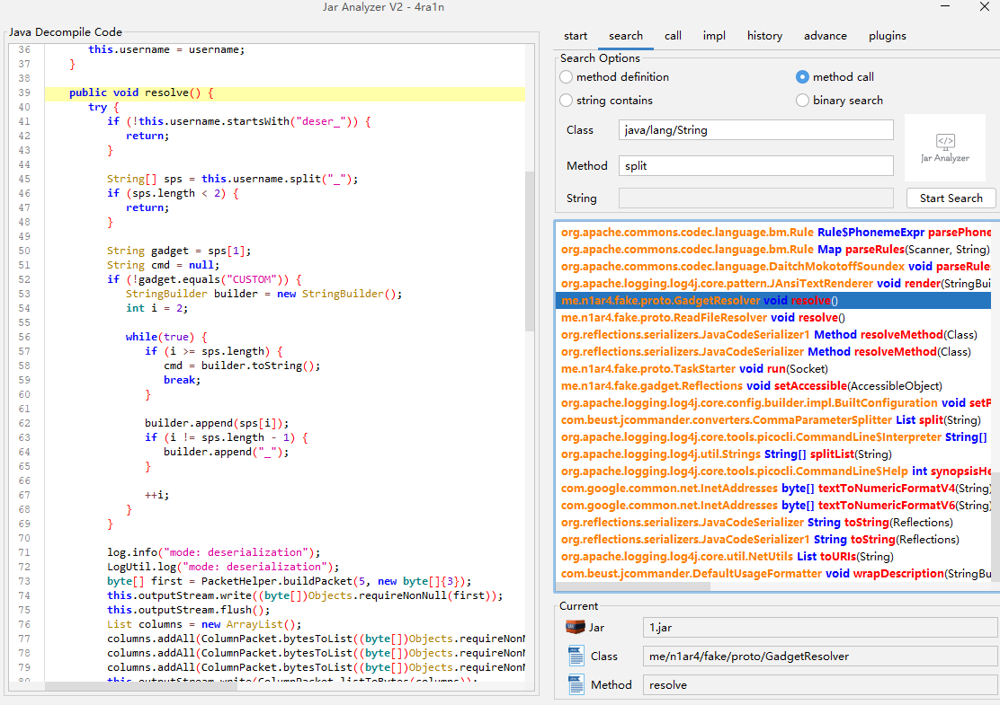
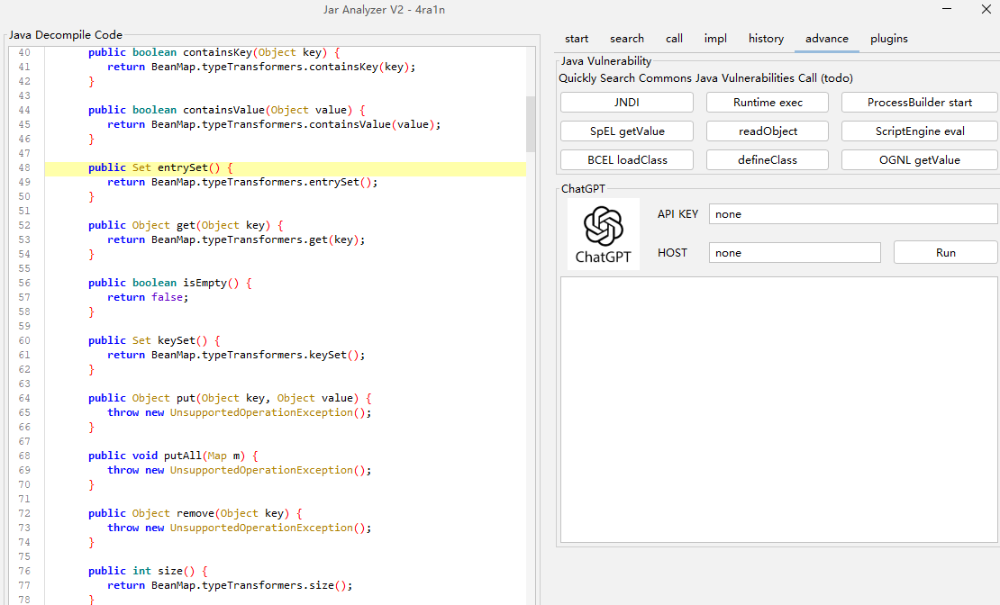
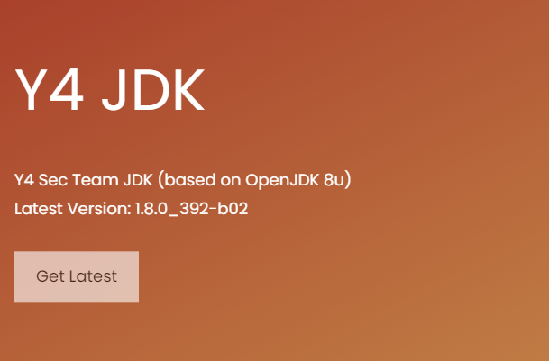

# Jar-Analyzer V2


`Jar Analyzer` 是一个分析 `Jar` 文件的 `GUI` 工具：
- 方便地搜索方法之间的调用关系
- 方便地搜索 `Jar` 文件中的字符串
- 对于方法字节码/指令等高级分析
- 一键反编译

相比 `Jar-Analyzer V1` 在 `V2` 版本中解决了很多重要问题：
- 中文不再乱码，代码 `GUI` 部分更美观
- 支持大 `Jar` 文件以及批量分析
- 支持保存状态，重启还原上次分析内容

另外有很多改进功能：
- 更好的 `GUI` 界面，代码高亮改进
- 文件树改进，按照文件夹以及字母排序
- 反编译改进，优化对内部类的处理
- 自动搜索 `rt.jar` 并加入分析
- 一键查看任意方法的 `Control Flow Gragh`
- 一键查看任意方法的 `Stack Frame` 分析

更多的功能正在开发中

有问题和建议欢迎提 `issue`

[前往下载](https://github.com/jar-analyzer/jar-analyzer/releases/latest)

## 一些截图

指令分析


`CFG` 分析


`JVM Stack Frame` 分析


首页


方法调用搜索



方法调用关系


高级分析：正在开发中



## 注意事项

本工具的基本原理：
- 解压所有 `Jar` 文件到 `jar-analyzer-temp` 目录
- 在当前目录构建数据库 `jar-analyzer.db` 文件
- 在当前目录新建文件 `.jar-analyzer` 记录状态


注意：当 `Jar` 数量较多或巨大时**可能导致临时目录和数据库文件巨大**

## Release 说明

在 `release` 中提供三种下载：
- `embed` 使用系统 `JDK/JRE` 的 `exe` 下载 (需要自行安装 `JRE`)
- `system` 内置安全 `Y4 JRE` 的 `exe` 版本下载 (无需另外安装一键启动)
- 简单的 `Jar` 文件 (可供 `Ubuntu` 和 `MacOS` 使用)

由于本工具仅在 `Windows` 中测试，其他操作系统可能会有未知的问题

在 `Ubuntu` 中也可以使用安全的 `Y4 JRE` 来启动



关于 `Y4 JDK/JRE` 项目: https://y4sec-team.github.io/jdk8u/

## 其他

如果你希望体验老版本 (不再维护) 的 `Jar Analyzer` 可以访问：
- https://github.com/4ra1n/jar-analyzer-cli
- https://github.com/4ra1n/jar-analyzer-gui

为什么我不选择 `IDEA` 而要选择 `Jar Analyzer V2` 工具：
- 因为 `IDEA` 不支持分析无源码的 `Jar` 包
- 本工具有一些进阶功能是 `IDEA` 不支持的 (指令/CFG/Stack分析)

(1) 什么是方法之间的关系

```java
class Test{
    void a(){
        new Test().b();
    }
    
    void b(){
        Test.c();
    }
    
    static void c(){
        // code
    }
}
```

如果当前方法是 `b`

对于 `a` 来说，它的 `callee` 是 `b`

对于 `b` 来说，它的 `caller` 是 `a`

(2) 如何解决接口实现的问题

```java
class Demo{
    void demo(){
        new Test().test();
    }
}

interface Test {
    void test();
}

class Test1Impl implements Test {
    @Override
    public void test() {
        // code
    }
}

class Test2Impl implements Test {
    @Override
    public void test() {
        // code
    }
}
```

现在我们有 `Demo.demo -> Test.test` 数据, 但实际上它是 `Demo.demo -> TestImpl.test`.

因此我们添加了新的规则： `Test.test -> Test1Impl.test` 和 `Test.test -> Test2Impl.test`.

首先确保数据不会丢失，然后我们可以自行手动分析反编译的代码
- `Demo.demo -> Test.test`
- `Test.test -> Test1Impl.test`/`Test.test -> Test2Impl.test`

(3) 如何解决继承关系

```java
class Zoo{
    void run(){
        Animal dog = new Dog();
        dog.eat();
    }
}

class Animal {
    void eat() {
        // code
    }
}

class Dog extends Animal {
    @Override
    void eat() {
        // code
    }
}

class Cat extends Animal {
    @Override
    void eat() {
        // code
    }
}
```
`Zoo.run -> dog.cat` 的字节码是 `INVOKEVIRTUAL Animal.eat ()V`, 但我们只有这条规则 `Zoo.run -> Animal.eat`, 丢失了 `Zoo.run -> Dog.eat` 规则

这种情况下我们添加了新规则： `Animal.eat -> Dog.eat` 和 `Animal.eat -> Cat.eat`

首先确保数据不会丢失，然后我们可以自行手动分析反编译的代码
- `Zoo.run -> Animal.eat`
- `Animal.eat -> Dog.eat`/`Animal.eat -> Cat.eat`

## 致谢

感谢以下项目提供的思路和代码
- https://github.com/FabricMC/intellij-fernflower
- https://github.com/bobbylight/RSyntaxTextArea
- https://github.com/JackOfMostTrades/gadgetinspector
- https://github.com/lsieun/learn-java-asm
