# Jar-Analyzer

[CHANGE LOG](CHANGELOG.MD)

`jar-analyzer` 项目连续 `5` 年更新，共发布 `55` 个版本（含 `v1` 和 `v2` 版本）完全开源，完全免费

The `jar-analyzer` project has been continuously updated for `5` years, with `55` versions released, contains v1 and v2 version, completely open source and completely free.

官方文档：https://docs.qq.com/doc/DV3pKbG9GS0pJS0tk

如果贡献代码：fork 本项目到自己仓库，参考 [build](#build) 部分搭建项目，提交 Pull Requests 即可

感谢以下贡献者（排名不分先后）

<p>
  <a href="https://github.com/4ra1n"></a>
  <a href="https://github.com/whwlsfb"></a>
  <a href="https://github.com/0cat-r"></a>
  <a href="https://github.com/Gosiu"></a>
  <a href="https://github.com/ly-test-fuzz"></a>
  <a href="https://github.com/sensensen404"></a>
  <a href="https://github.com/MyDynasty"></a>
  <a href="https://github.com/TianMing2018"></a>
  <a href="https://github.com/hacats"></a>
  <a href="https://github.com/R0ser1"></a>
  <a href="https://github.com/su18"></a>
  <a href="https://github.com/7eleven"></a>
  <a href="https://github.com/L-codes"></a>
  <a href="https://github.com/osword"></a>
</p>


Jar Analyzer

- 一个 `JAR` 包分析工具
- 完善美观的 `GUI` 支持（现代化 `Java GUI` 界面，可拖拽，明暗橙三主题，十种风格）
- 基础分析（支持 `Jar/War/Classes` 输入，支持多文件，支持嵌套 `FatJar`）
- 黑白名单配置（构建数据库和搜索功能都支持黑白名单过滤，支持精确类名和包名过滤）
- 反编译（内置 `Fernflower` 改进版本双击反编译，使用 `JavaParser` 精确定位方法位置）
- 方法调用关系搜索（构建方法调用关系数据库，可搜方法定义与方法引用，支持精确和模糊搜索）
- 方法调用链 `DFS` 算法分析（支持 **正向/反向** 调用链分析，基于 `DFS` 算法的深度调用链追踪）
- 简单的模拟 `JVM` 污点分析实现，可验证 `DFS` 算法推导方法调用链可行性（beta）
- 字符串搜索（搜索 `LDC` 指令，支持模糊搜索和精确搜索，可定位具体方法，联动调用进行分析）
- `Java Web` 组件入口分析（`Java Servlet/Filter` 组件分析，`Spring` 入口信息一键分析）
- `CFG` 程序分析（方法内部控制流可视化，基本块划分与展示，异常处理流程分析）
- `JVM` 栈帧分析（局部变量表与操作数栈状态跟踪，运行时数据流静态分析）
- 自定义表达式搜索（基于 `SpEL` 的多种语法组合搜索，用于搜索漏洞 `Gadget` 等）
- 常见安全分析功能（支持简单的 `SCA` 分析，敏感信息泄漏分析，可能的 `gadget` 分析）
- 应急响应分析功能（一键提取序列化数据中的恶意 `class` 反编译，一键提取 `BCEL` 代码）
- 测试功能：不同于 `IDEA` 等工具的源码级调试，实现了字节码级别的单步动态调试（仅初步实现）

为什么选择 Jar Analyzer 

- 简单易上手，相比 `codeql/tabby` 简化很多，足够应对 `90%` 场景
- 完善且美观的 `GUI` 设计， 只需鼠标点点点，即可进行大多数的代码审计
- 内置常见的 `source` 入口分析，支持动态的 `sink` 配置文件规则，方便快捷
- 代码完全开源，构建基于 `github actions` 你可以随意查看功能代码，定制功能
- 本项目跟随主流技术路线，尝试基于 `AI` 做探索（支持 `mcp` 和 `n8n` 流程等）

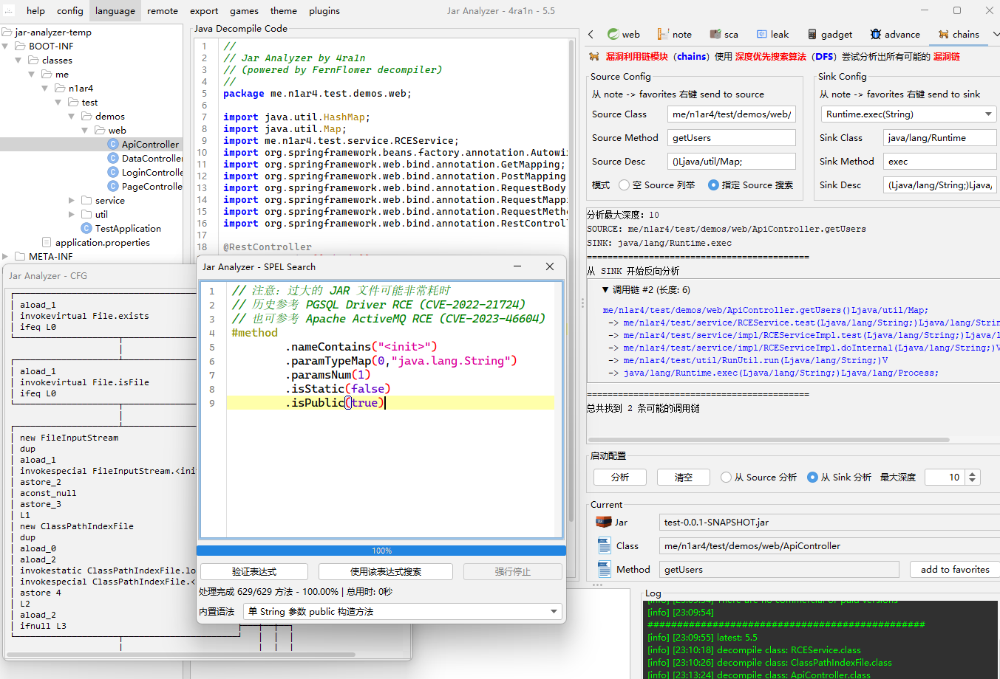

静态分析 `spring / java web` 项目

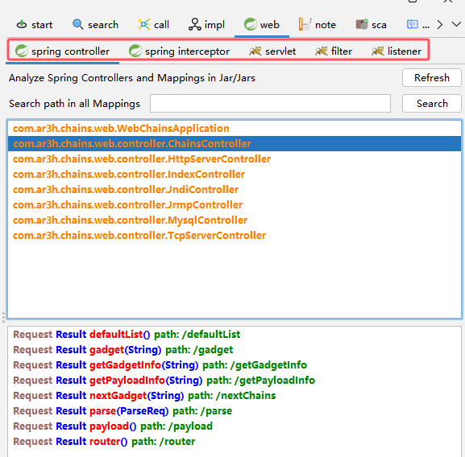

一键快速搜索（自从 `4.0` 版本后支持通过配置动态生成 `GUI` 按钮）

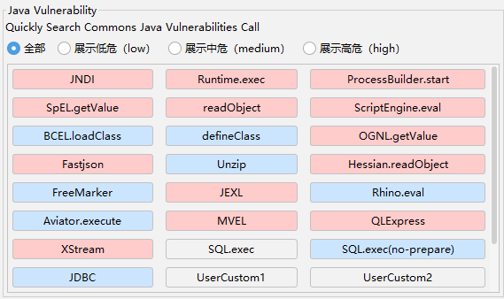

例如一个 `Runtime.exec` 的动态规则（配好后直接生成按钮和搜索逻辑）

```yaml
  Runtime.exec:
    - !!me.n1ar4.jar.analyzer.engine.SearchCondition
      className: java/lang/Runtime
      methodName: exec
      methodDesc: null
```

自从 `5.3` 版本后支持深度优先搜索算法自动分析漏洞链

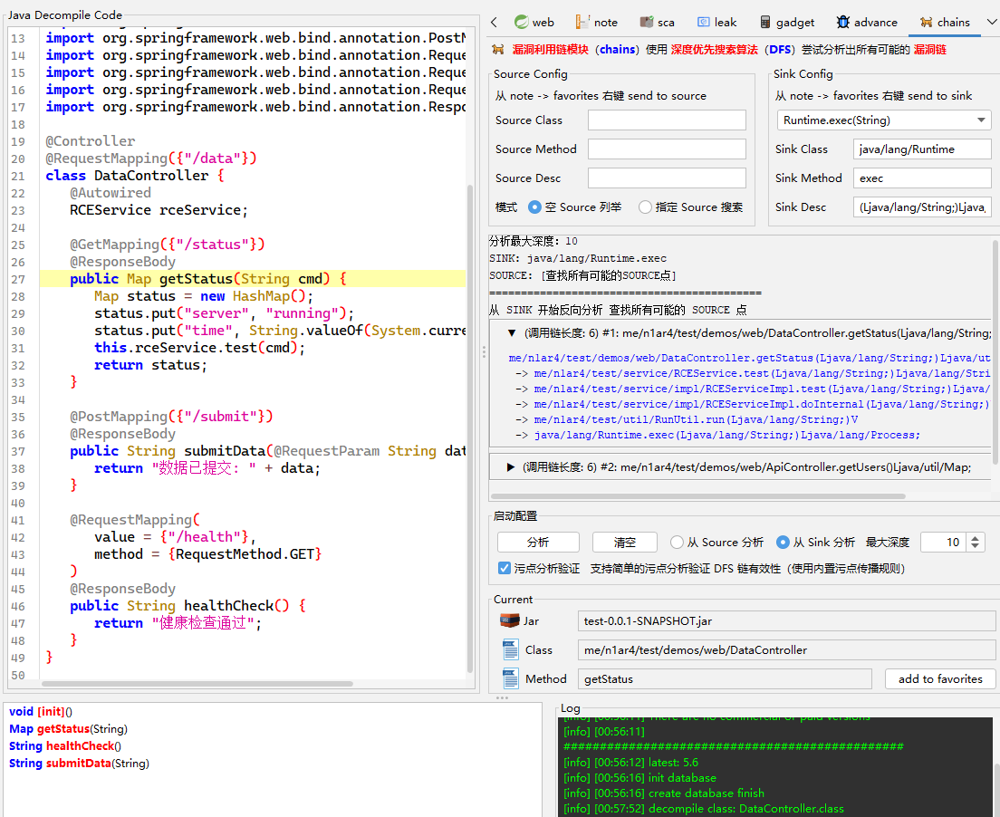

自从 `5.7` 版本后支持简单的模拟 `JVM` 污点分析验证 `DFS` 结果（勾选污点分析验证即可）

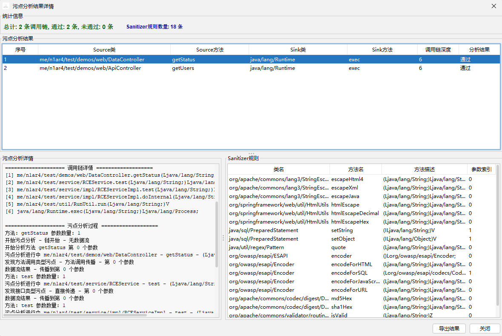

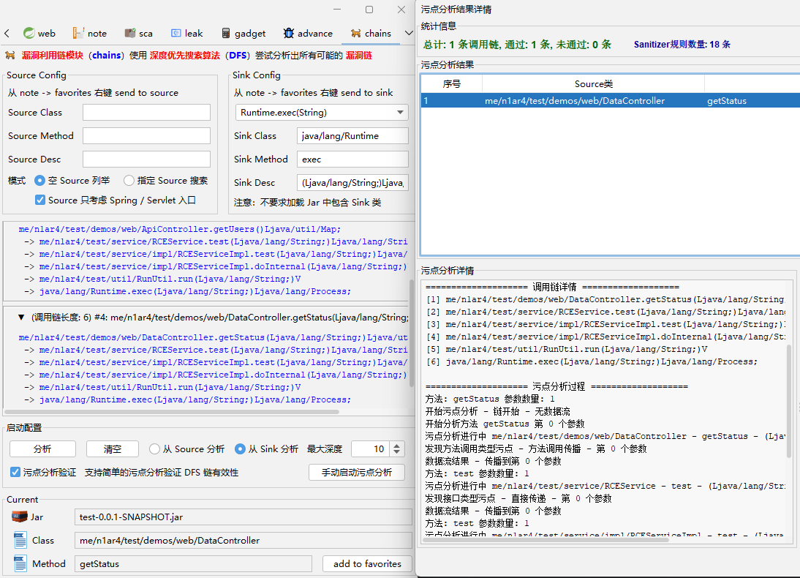

通过 `agent` 分析 `tomcat`

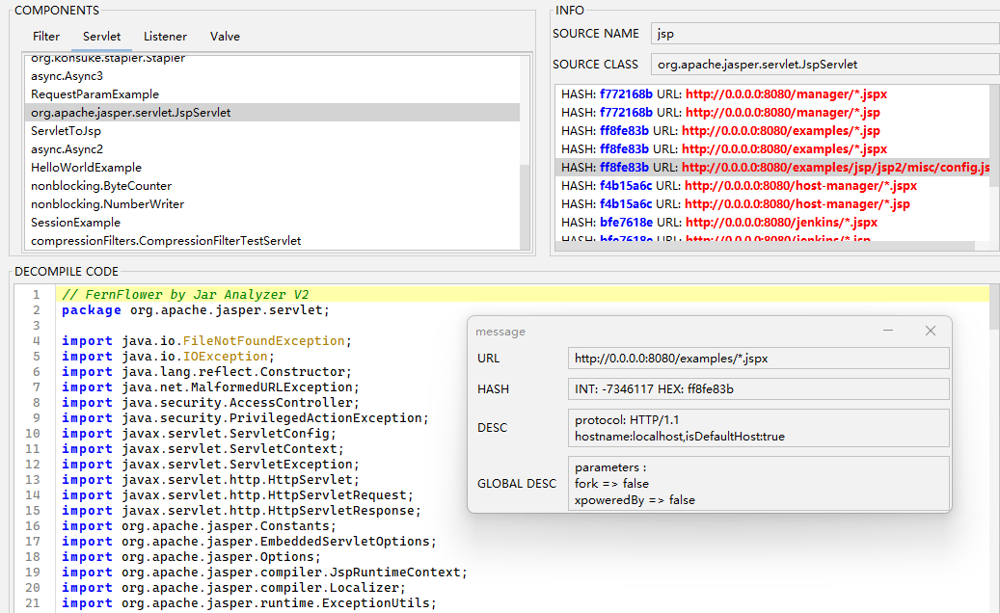

自从 `5.0` 版本后大幅改进了表达式搜索功能

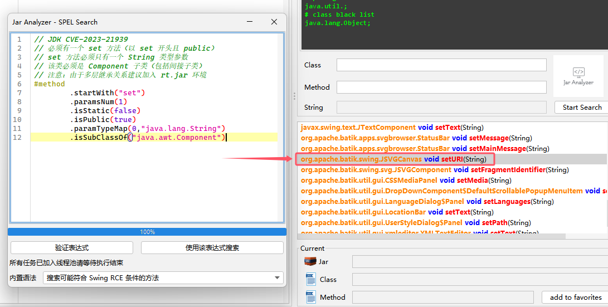

从 `4.0` 版本后支持信息泄露检查（部分正则来源于 [HaE](https://github.com/gh0stkey/HaE) 项目）

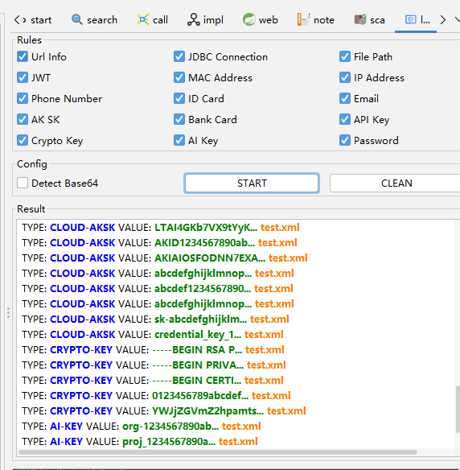

从 `4.0` 版本开始可以和 `IDEA` 一样快捷键两次 `shift` 调出 `Lucene` 全局搜索

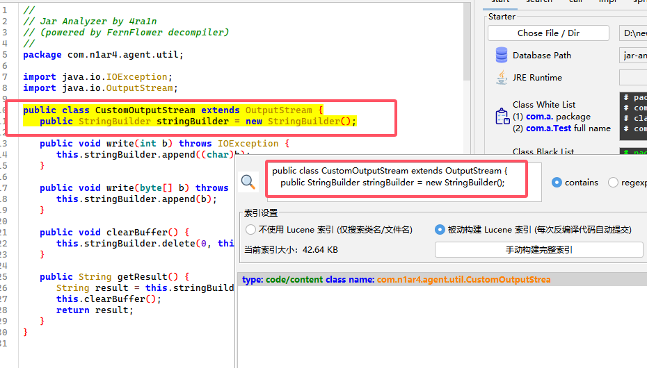

自从 `4.2` 版本后支持黑暗主题切换

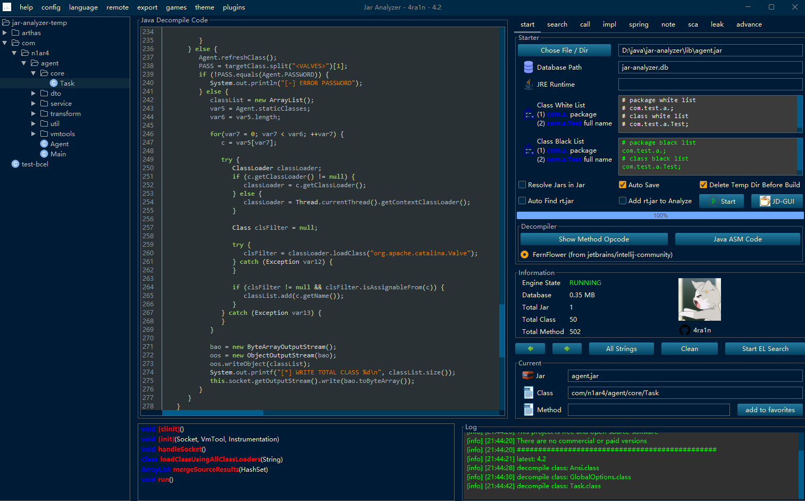

## AI 相关

自从 `5.10` 版本后支持 `MCP` 请参考文档 [MCP](mcp-doc/README.md)


结合 `jar-analyzer mcp` 可以在 `n8n` 平台使用，文档：[n8n-doc](n8n-doc)

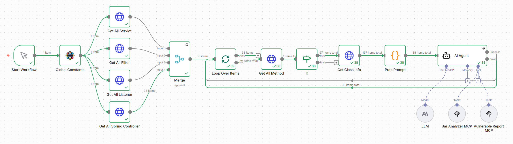

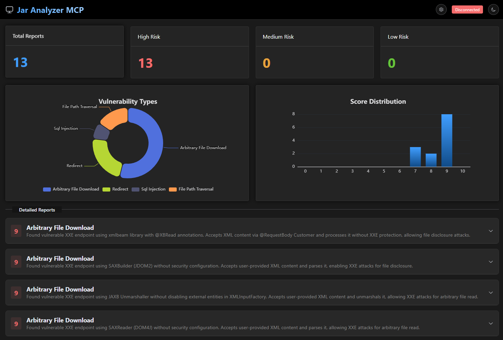

使用 `jar-audit-agent` skill 配合 `jar-analyzer` 进行 `Java` 代码审计

该功能正在开发中，不够稳定和完善，欢迎尝试使用，一起优化：[文档](skills)

感谢 0cat https://github.com/0cat-r

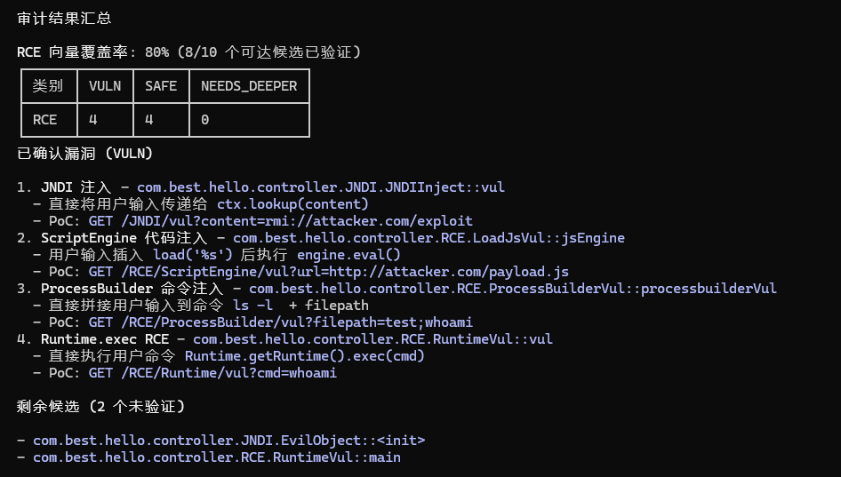

## 常见用途

- 场景01：从大量 `JAR` 中分析某个方法在哪个 `JAR` 里定义（精确到具体类具体方法）
- 场景02：从大量 `JAR` 中分析哪里调用了 `Runtime.exec` 方法（精确到具体类具体方法）
- 场景03：从大量 `JAR` 中分析字符串 `${jndi` 出现在哪些方法（精确到具体类具体方法）
- 场景04：从大量 `JAR` 中分析有哪些 `Spring Controller/Mapping` 信息（精确到具体类具体方法）
- 场景05：从大量 `JAR` 中分析是否存在 `Apache Log4j2` 漏洞（匹配所有 `CVE` 漏洞）
- 场景06：从大量 `JAR` 中分析是否有使用 `FASTJSON 47/68/80` 等存在漏洞的版本
- 场景07：从大量 `JAR` 中分析各种常见的 `Java` 安全漏洞调用出现在哪些方法
- 场景08：你需要深入地分析某个方法中 `JVM` 指令调用的传参（带有图形界面）
- 场景09：你需要深入地分析某个方法中 `JVM` 指令和栈帧的状态（带有图形界面）
- 场景10：你需要深入地分析某个方法的 `Control Flow Graph` （带有图形界面）
- 场景11：你有一个 `Tomcat` 需要远程分析其中的 `Servlet/Filter/Listener` 信息
- 场景12：你有一个序列化数据里面包含了恶意的 `Class` 字节码需要一键提取分析
- 场景13：你有一个 `BCEL` 格式的字节码需要一键反编译代码分析
- 场景14：你有一大堆 `Jar` 文件或目录需要全部批量反编译导出代码
- 场景15：从大量 `JAR` 中分析 `IP` 地址/手机号/邮箱等各种信息泄露
- 场景16：需要将 `JAR` 分析加入到已有的工作流（`CICD` / `AI workflow` 等） 
- 测试功能：字节码指令级别的调试

## 更新记录

- 自从 `2.14` 版本之后支持了全屏显示的功能
- 自从 `2.15` 版本后支持代码区域字符串搜索功能
- 自从 `2.15` 版本后支持通过 `HTTP` 分析远程文件
- 自从 `2.16` 版本后支持一键导出反编译 `JAVA` 代码
- 自从 `2.17` 版本后支持字节码指令级别的远程调试（参考 [示例图](img/0035.png)）
- 自从 `2.17` 版本后支持从序列化数据一键提取恶意 `JAVA` 代码（参考 [示例图](img/0036.png)）
- 自从 `2.18` 版本后支持 `HTTP API` 查询接口（参考 [示例图](img/0038.png)）
- 自从 `2.19` 版本后支持启动时配置 `10` 种 `UI` 主题（`LookAndFeel`）
- 自从 `2.19` 版本后支持实时的 `CPU` 占用和内存的折线图展示（参考 [示例图](img/0040.png)）
- 自从 `2.20` 版本后支持选中字符串全局高亮显示（参考 [示例图](img/0041.png)）
- 自从 `2.21` 版本后支持分析配置类和包名的白名单
- 自从 `2.21` 版本后支持左侧文件数使用 `CTRL+F` 打开类名搜索（参考 [示例图](img/0045.png)）
- 自从 `2.21` 版本后新增内置开启 `ZGC` 的 `JRE 21` 环境（仅包含核心功能）
- 自从 `2.23` 版本后新增 `SCA` 分析（参考 [示例图1](img/0051.png) [示例图2](img/0050.png)）
- 自从 `2.24` 版本后改善 `SCA` 分析逻辑（显著提高扫描效率）
- 自从 `3.0` 版本后支持生成 `HTML` 方法调用图（参考 [示例图](img/0053.png)）
- 自从 `3.0` 版本后支持代码区域选中字符串右键搜索（参考 [示例图](img/0054.png)）
- 自从 `3.0` 版本后支持方法右键添加备忘录（参考 [示例图](img/0055.png)）
- 自从 `3.0` 版本后新增多种常见的 `JAVA RCE` 漏洞调用一键搜索功能
- 自从 `3.1` 版本后支持 `BCEL` 字符串一键反编译 `Java` 代码（参考 [示例图](img/0061.png)）
- 自从 `3.1` 版本后远程 `Tomcat` 分析改为 `premain` 方式（参考 [示例图](img/0062.png)）
- 自从 `3.2` 版本后远程 `Tomcat` 分析功能重写和增强（参考 [示例图](img/0065.png)）
- 自从 `4.0` 版本后方法跳转的定位大幅优化和精确（使用 `JavaParser` 库实现）
- 自从 `4.0` 版本后支持一键的信息泄露检查（参考 [示例图](img/0084.png)）
- 自从 `4.0` 版本后支持类似 `IDEA` 的全局搜索（基于 `Lucene` 支持代码片段）
- 自从 `4.0` 版本后支持不限制次数的前进后退步骤（记录所有的操作信息）
- 自从 `4.0` 版本批量反编译 `Jar` 导出源码功能修复增强
- 自从 `4.0` 版本后新增多个图标 `GUI` 界面进一步美化
- 自从 `4.1` 版本后内置 `JD-GUI` 可以跳过分析快速查看
- 自从 `4.2` 版本后支持黑暗主题切换
- 自从 `4.4` 版本后支持不跳转情况下右键预览方法代码
- 自从 `5.0` 版本之后 `Panel` 支持拖动拉伸缩小
- 自从 `5.0` 版本之后支持了 `Interceptor/Servlet/Filter/Listener` 分析
- 自从 `5.0` 版本之后大幅改进了表达式搜索相关功能
- 自从 `5.1` 版本之后支持了简单的 `Gadget` 分析
- 自从 `5.3` 版本后支持深度优先搜索算法自动分析漏洞链
- 自从 `5.7` 版本后支持污点分析（beta）并在 `5.8` 版本修复和完善
- 自从 `5.10` 版本后支持了 `MCP` 请参考文档 [MCP](mcp-doc/README.md)

[详细更新日志 - CHANGE LOG](CHANGELOG.MD)

有问题和建议欢迎提 `issue` 更多的功能正在开发中 [前往下载](https://github.com/jar-analyzer/jar-analyzer/releases/latest)

## 用户评价

(01) 我发现 `jar-analyzer` 性能方面很出色（某知名安全研究员）

(02) 某些场景 `jar-analyzer` 的表达式功能比 `codeql` 更好用（某安全研究员）

(03) 我使用 `jar-analyzer` 挖了不少的 `0 day` 漏洞，推荐使用 (某知名安全研究员)

(04) 大佬的 `jar-analyzer` 很好用 （某乙方安全工程师）

(05) 师傅的 `jar-analyzer` 太强了 （某知名安全研究员）

(06) 刚才老板大力表扬了 `jar-analyzer` 说超级好用（某甲方安全工程师）

(07) 大佬，先说一句 `jar-analyzer` 真好用（某乙方安全工程师）

(08) `jar-analyzer` 最好用（某乙方安全工程师）

(09) `Java` 漏洞挖掘神器 `jar-analyzer`（某乙方安全工程师）

(10) 我用 `jar-analyzer` 辅助挖到了价值 `10w` 的 `0 day`（某年入百万安全研究员）

(11) `jar-analyzer` 可以快速筛选符合的 `gadget` 辅助挖掘新链（知名项目 `java-chains` 创始人）

(12) `jar-analyzer` 在手 `java` 漏洞不愁（某安全公司总裁）

(13) 拼尽全力，无法战胜（某大甲方安全工程师，有丰富的代码审计和 `SAST` 工具开发经验）

(14) 这几天已经用这个挖到了几个洞了，对于新手很友好（某安全工程师）

(15) `DFS` 漏洞利用链分析功能完整，用起来比 `tabby` 和 `codeql` 都要简单（某安全工程师）

(16) 使用 `jar-anlyzer mcp` 配合 `n8n` 工作流，确实能挖到洞 (某安全专家)
 
## 表达式

表达式搜索是 `jar-analzyer` 重要的高级功能：可以自定义多种条件组合搜索方法

表达式搜索位于首页以及 `Advance` 的 `Plugins` 部分

注意：如果表达式效率过低，可能是默认内存过小原因，可以考虑修改启动脚本 `-Xms` 参数

```shell
set "java_args=-XX:+UseG1GC -Xms2g -XX:MaxGCPauseMillis=200 %other_args%"
```

[详细文档](doc/README-el.md)

## 感谢列表

- 4ra1n (https://github.com/4ra1n) (项目作者) 
- whw1sfb (https://github.com/whwlsfb) (第一次贡献，重要 AI 贡献)
- 0cat (https://github.com/0cat-r) (重要 AI 贡献)
- Honey Baby (https://github.com/Gosiu) (多次重要贡献) 
- fantasy (https://github.com/ly-test-fuzz) 
- phil (https://github.com/sensensen404)
- MyDynasty (https://github.com/MyDynasty) 
- TianMing2018 (https://github.com/TianMing2018) 
- hacats (https://github.com/hacats) 
- R0ser1 (https://github.com/R0ser1) 
- su18 (https://github.com/su18) 
- 7eleven (https://github.com/7-e1even)
- L-codes (https://github.com/L-codes) (AI 贡献)
- osword (https://github.com/zhzhdoai) (AI 贡献)

## 时间

- `Jar Analyzer V1` 最初版诞生于 `2022.11.27`
- `Jar Analyzer V2` 在 `2023.10.23` 第一次提交
- `Jar Analyzer v2` 正式版在 `2023.12.07` 发布
- `Jar Analyzer V2` 在 `2024.08.15` 发布 `3.0` 版本
- `Jar Analyzer V2` 在 `2024.09.30` 总 `Star` 破千
- `Jar Analyzer V2` 在 `2024.11.07` 发布 `4.0` 版本
- `Jar Analyzer V2` 在 `2025.01.07` 日下载量破万

## 性能测试

参考 [性能测试文档](doc/README-test.md) 对比分析 `G1GC` 和 `ZGC` 情况

## 其他截图

[截图文档](doc/README-screenshot.md)

## BUILD

注意：首先对你的 `IDEA` 进行设置（本项目不支持 `Eclipse/VS Code` 等 `IDE` 环境）


注意：过高版本的 `IDEA` 可能删除了该功能，可以在插件市场搜索 `Swing UI Designer` 安装

编译和构建过程如下：（以 `Windows` 为例其他环境类似）

由于 `jar-analyzer` 历史提交过大，请使用 `--depth 1` 加速克隆

```shell
git clone --depth 1 https://github.com/jar-analyzer/jar-analyzer
```

核心项目构建

1. 重要：确保你安装了 `JDK 8 64位` （建议 `OpenJDK`）
2. 重要：如果你修改了代码请确保在 `IDEA` 环境中至少启动一次（生成 `GUI` 代码）
3. 重要：确保你安装了 `Maven 3.X` （一般 `IDEA` 已自带）
4. 可选：完善贡献者信息：检查修改 `thanks.md/thanks.txt` 和 `pom.xml`
5. 可选：使用 `cmake` 构建 `native` 目录生成 `dll` 文件放入 `resources`

MCP 构建

1. 确保安装了 `golang 1.24` 及以上版本
2. 打开 `mcp` 目录即可（标准 `go mod` 项目）
3. 可以基于 `gox` 目录编译多平台可执行文件（开源 `gox` 修改版）

其他组件构建

1. 可选：构建 `agent` 子项目 `cd agent && package.bat`
2. 可选：使用 `winres` 和 `gcc` 构建启动 `exe` 文件和图标信息
3. 可选：完整发版参考 `build.py` 和 `build.yml` 文件

## 进阶功能

以上是基础功能，进阶和测试性的功能请参考：[进阶测试性功能](doc/README-advance.md)

例如类似 `OD/GDB` 的指令级 `GUI` 调试（未完成）


## 快捷键

- `CTRL+X` 方法交叉引用 快速跳转方法 `caller` 和 `callee` 页面
- `CTRL+F` 代码区域搜索 打开搜索面板 支持 `next` 和 `prev` 选项
- `CTRL+F` 文件树区搜索 显示搜索面板 搜索文件树中的类名以及内部类

## UI 主题

支持以下：

- default (默认使用 类似 `IDEA` 主题)
- metal
- win (仅 `Windows` 支持)
- win-classic (仅 `Windows` 支持)
- motif
- mac (仅 `MacOS` 支持)
- gtk (仅某些 `Linux` 支持)
- cross
- aqua (仅 `MacOS` 支持)
- nimbus

在启动时指定：`java -jar jar-analyzer.jar gui -t [theme]`

例如：`java -jar jar-analyzer.jar gui -t win-classic`

或者修改启动脚本的代码

```shell
set "theme_name=default"
```

## 注意

[文档](doc/README-note.md)

## 子项目

[文档](doc/README-sub.md)

## 其他

早期文章视频以及解释一些内部的原理和注意事项

[文档](doc/README-others.md)

## 参考

[文档](doc/README-thanks.md)

## API

[文档](doc/README-api.md)

## 安全公告

- [\[GHSA-43rf-3hm4-hv5f\] 反编译恶意的 CLASS 文件可能导致程序不可用](https://github.com/jar-analyzer/jar-analyzer/security/advisories/GHSA-43rf-3hm4-hv5f)
- [\[GHSA-x5h2-78p8-w943\] Jar Analyzer 2.13 版本之前存在 SQL 注入漏洞](https://github.com/jar-analyzer/jar-analyzer/security/advisories/GHSA-x5h2-78p8-w943)
- [\[GHSA-jmcg-r2c5-7m29\] Jar Analyzer 存在 ZIP SLIP 漏洞（最坏情况可导致 RCE 风险）](https://github.com/jar-analyzer/jar-analyzer/security/advisories/GHSA-jmcg-r2c5-7m29)
- [\[GHSA-h6vc-3rcp-p7qp\] 表达式分析功能中的 SpEL 注入漏洞可导致远程代码执行](https://github.com/jar-analyzer/jar-analyzer/security/advisories/GHSA-h6vc-3rcp-p7qp)

不再接受用户的输入导致的安全问题，除非恶意的输入 `class/jar` 文件可能导致的安全问题

不再接收 `GUI` 中可能的漏洞，不认为通过 `Webswing` 等方式暴露到 `web` 端会产生漏洞

注意：当 `Jar` 数量较多或巨大时 **可能导致临时目录和数据库文件巨大** 请确保足够的空间

有 `UI` 兼容性问题请查看 `ISSUE` 部分的置顶

## Star

<div align="center">


</div>
