# Jar-Analyzer

[CHANGE LOG](src/main/resources/CHANGELOG.MD)


首页

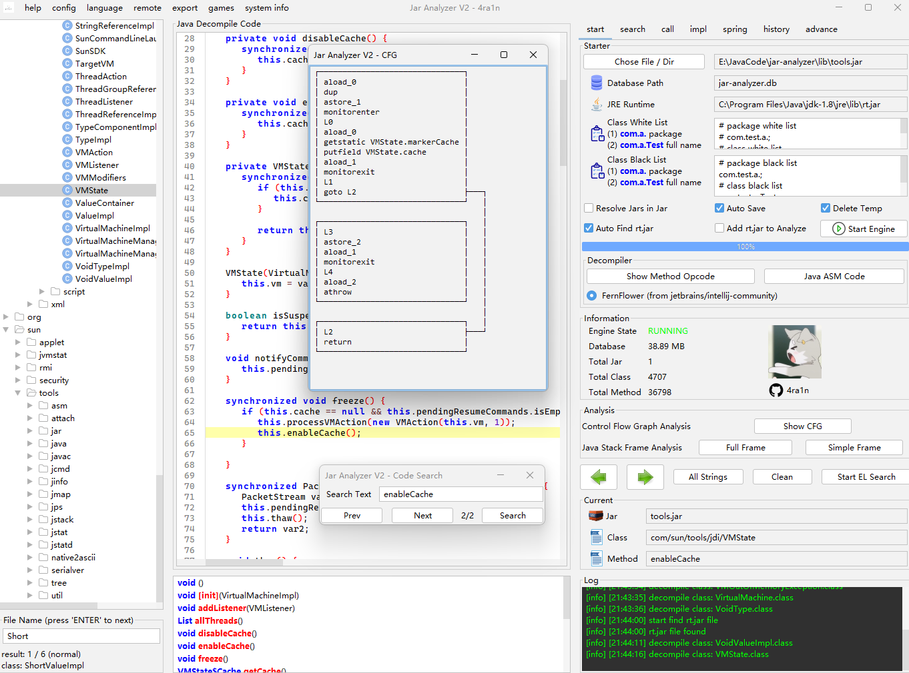

一键快速搜索

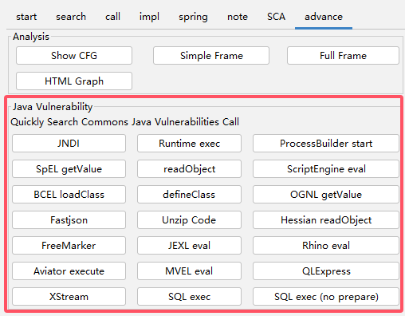

`Jar Analyzer` 是一个分析 `Jar` 文件的 `GUI` 工具：

- 支持大 `Jar` 以及批量 `Jars` 分析
- 方便地搜索方法之间的调用关系
- 分析 `LDC` 指令定位 `Jar` 中的字符串
- 一键分析 `Spring Controller/Mapping`
- 对于方法字节码和指令的高级分析
- 一键反编译，优化对内部类的处理
- 一键生成方法的 `CFG` 分析结果
- 一键生成方法的 `Stack Frame` 分析结果
- 远程分析 `Tomcat` 中的 `Servlet` 等组件
- 自定义 `SQL` 语句进行高级分析
- 自从 `2.14` 版本之后支持了全屏显示的功能
- 自从 `2.15` 版本后支持代码区域字符串搜索功能
- 自从 `2.15` 版本后支持通过 `HTTP` 分析远程文件
- 自从 `2.16` 版本后支持一键导出反编译 `JAVA` 代码
- 自从 `2.17` 版本后支持字节码指令级别的远程调试（参考 [示例图](img/0035.png)）
- 自从 `2.17` 版本后支持从序列化数据一键提取恶意 `JAVA` 代码（参考 [示例图](img/0036.png)）
- 自从 `2.18` 版本后支持 `HTTP API` 查询接口（参考 [示例图](img/0038.png)）
- 自从 `2.19` 版本后支持启动时配置 `10` 种 `UI` 主题（`LookAndFeel`）
- 自从 `2.19` 版本后支持实时的 `CPU` 占用和内存的折线图展示（参考 [示例图](img/0040.png)）
- 自从 `2.20` 版本后支持选中字符串全局高亮显示（参考 [示例图](img/0041.png)）
- 自从 `2.21` 版本后支持分析配置类和包名的白名单
- 自从 `2.21` 版本后支持左侧文件数使用 `CTRL+F` 打开类名搜索（参考 [示例图](img/0045.png)）
- 自从 `2.21` 版本后新增内置开启 `ZGC` 的 `JRE 21` 环境（仅包含核心功能）
- 自从 `2.23` 版本后新增 `SCA` 分析（参考 [示例图1](img/0051.png) [示例图2](img/0050.png)）
- 自从 `2.24` 版本后改善 `SCA` 分析逻辑（显著提高扫描效率）
- 自从 `3.0` 版本后支持生成 `HTML` 方法调用图（参考 [示例图](img/0053.png)）
- 自从 `3.0` 版本后支持代码区域选中字符串右键搜索（参考 [示例图](img/0054.png)）
- 自从 `3.0` 版本后支持方法右键添加备忘录（参考 [示例图](img/0055.png)）
- 自从 `3.0` 版本后新增多种常见的 `JAVA RCE` 漏洞调用一键搜索功能
- 自从 `3.1` 版本后支持 `BCEL` 字符串一键反编译 `Java` 代码（参考 [示例图](img/0061.png)）
- 自从 `3.1` 版本后远程 `Tomcat` 分析改为 `premain` 方式（参考 [示例图](img/0062.png)）

更多的功能正在开发中

有问题和建议欢迎提 `issue`

[前往下载](https://github.com/jar-analyzer/jar-analyzer/releases/latest)

`Jar Analyzer` 的用途

- 场景01：从大量 `JAR` 中分析某个方法在哪个 `JAR` 里定义（精确到具体类具体方法）
- 场景02：从大量 `JAR` 中分析哪里调用了 `Runtime.exec` 方法（精确到具体类具体方法）
- 场景03：从大量 `JAR` 中分析字符串 `${jndi` 出现在哪些方法（精确到具体类具体方法）
- 场景04：从大量 `JAR` 中分析有哪些 `Spring Controller/Mapping` 信息（精确到具体类具体方法）
- 场景05：从大量 `JAR` 中分析是否存在 `Apache Log4j2` 漏洞（匹配所有 `CVE` 漏洞）
- 场景06：从大量 `JAR` 中分析是否有使用 `FASTJSON 47/68/80` 等存在漏洞的版本
- 场景07：你需要深入地分析某个方法中 `JVM` 指令调用的传参（带有图形界面）
- 场景08：你需要深入地分析某个方法中 `JVM` 指令和栈帧的状态（带有图形界面）
- 场景09：你需要深入地分析某个方法的 `Control Flow Graph` （带有图形界面）
- 场景10：你有一个 `Tomcat` 需要远程分析其中的 `Servlet/Filter/Listener` 信息
- 场景11：查实现接口 `A` 继承接口 `B` 类注解 `C` 且方法名 `test` 方法内调用 `D` 类 `a` 方法的方法（表达式搜索）
- 测试功能：字节码指令级别的调试 | 远程分析 | 一键导出反编译代码

## 相关

想深入交流可以发联系方式到邮箱后我拉你进群：`ZW15aXFpbmdAZ21haWwuY29t`

### 感谢列表

<a href="https://github.com/jar-analyzer/jar-analyzer/graphs/contributors">
  
</a>

### 时间

- `Jar Analyzer V1` 最初版诞生于 `2022.11.27`
- `Jar Analyzer V2` 在 `2023.10.23` 第一次提交
- `Jar Analyzer v2` 正式版在 `2023.12.07` 发布
- `Jar Analyzer V2` 在 `2024.08.15` 发布 `3.0` 版本

### 发版时间

目前版本 `3.X` 计划每月更新一次（如果有重大更新可能发布 `4.X` 版本）

- 2024.10.08
- 2024.11.08
- 2024.12.08

### 文章视频

用户使用文章

- [利用 jar-analyzer 分析 CVE-2022-42889](https://zone.huoxian.cn/d/2884-jar-analyzer-cve-2022-42889)
- [某人力系统的代码审计](https://forum.butian.net/share/3109)

用户使用视频

- [Jar Analyzer V2 教程（早期版本）](https://www.bilibili.com/video/BV1ac411S7q4)
- [通过 jar-analyzer 分析漏洞 CVE-2022-42889](https://www.bilibili.com/video/BV1a94y1E7Nn)
- [Jar Analyzer V2 新版本功能介绍](https://www.bilibili.com/video/BV1Dm421G75i)

### 性能测试

参考 [性能测试文档](doc/README-test.md) 对比分析 `G1GC` 和 `ZGC` 情况

### 漏洞公告

- [\[GHSA-43rf-3hm4-hv5f\] 反编译恶意的 CLASS 文件可能导致程序不可用](https://github.com/jar-analyzer/jar-analyzer/security/advisories/GHSA-43rf-3hm4-hv5f)
- [\[GHSA-x5h2-78p8-w943\] Jar Analyzer 2.13 版本之前存在 SQL 注入漏洞](https://github.com/jar-analyzer/jar-analyzer/security/advisories/GHSA-x5h2-78p8-w943)
- [\[GHSA-jmcg-r2c5-7m29\] Jar Analyzer 存在 ZIP SLIP 漏洞（最坏情况可导致 RCE 风险）](https://github.com/jar-analyzer/jar-analyzer/security/advisories/GHSA-jmcg-r2c5-7m29)

注意：当 `Jar` 数量较多或巨大时**可能导致临时目录和数据库文件巨大**

有 `UI` 兼容性问题请查看 `ISSUE` 部分的置顶

### BUILD

注意：首先对你的 `IDEA` 进行设置（本项目不支持 `Eclipse/VS Code` 等 `IDE` 环境）

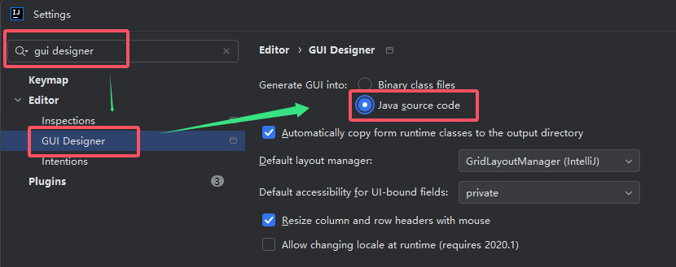

编译和构建过程如下：（以 `Windows` 为例其他环境类似）

1. 重要：确保你安装了 `JDK 8 64位` （无论 `Oracle JDK` 或 `OpenJDK` 都可）
2. 重要：如果你修改了代码请确保在 `IDEA` 环境中至少启动一次（生成 `GUI` 代码）
3. 重要：确保你安装了 `Maven 3.X` 并正确配置了 `PATH` 变量（需要使用 `mvn` 命令）
4. 可选：运行 `Contributor` 和 `ContributorMD` 生成最新贡献者信息
5. 可选：构建 `agent` 子项目 `cd agent && package.bat`
6. 重要：构建核心项目 `package.bat`
7. 可选：使用 `cmake` 构建 `native` 目录生成 `dll` 文件放入 `resources`
8. 可选：使用 `winres` 和 `gcc` 构建启动 `exe` 文件和图标信息
9. 可选：完整发版参考 `build.py` 和 `build.yml` 文件

## 表达式

表达式搜索是 `jar-analzyer` 重要的高级功能：可以自定义多种条件组合搜索方法

表达式搜索位于首页以及 `Advance` 的 `Plugins` 部分

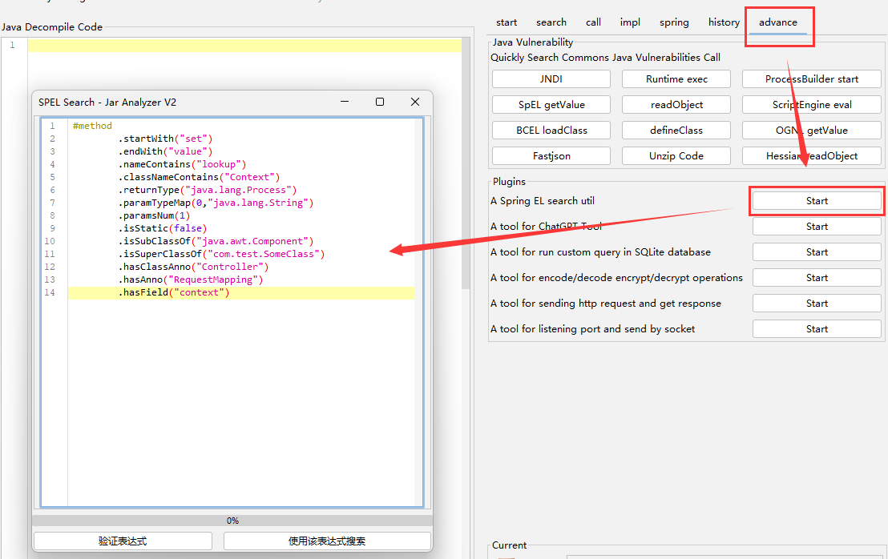

[详细文档](doc/README-el.md)

## 截图

方法调用关系

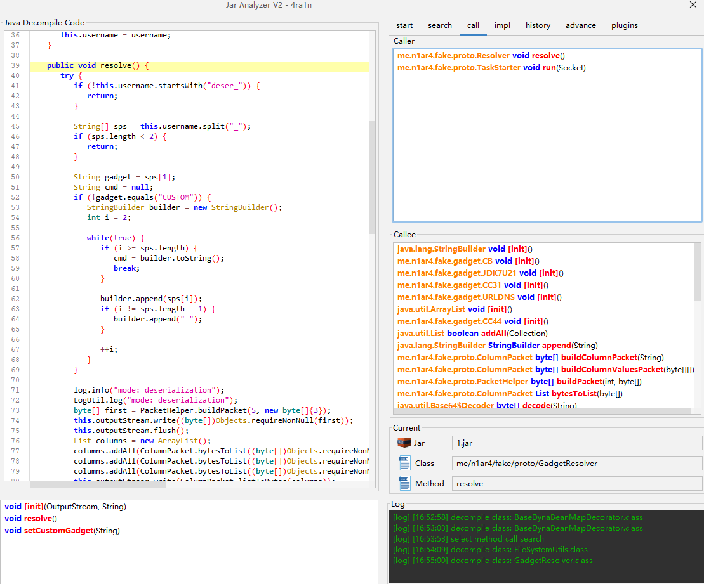

方法调用搜索 (支持 `equals/like` 选项，支持黑名单过滤)

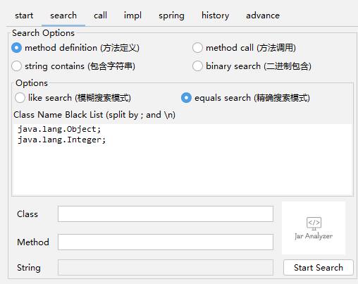

分析 `Spring Framework`


`Jar Analyzer 2.15` 版本以后支持代码区域的搜索

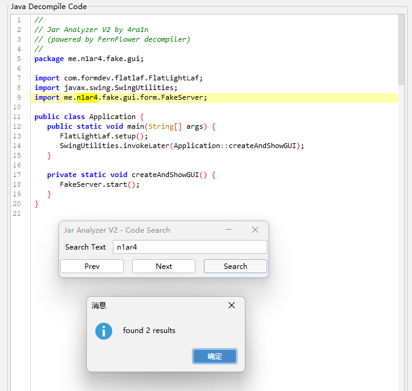

`Jar Analyzer 2.15` 版本以后支持远程 `Jar` 文件加载

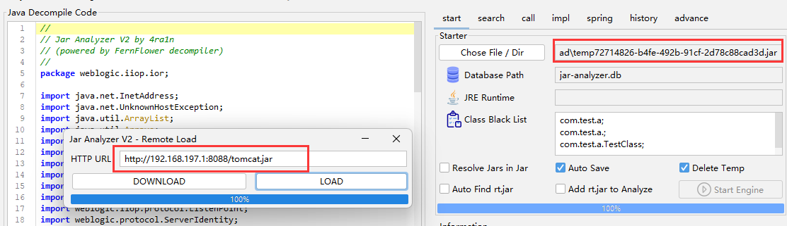

`Jar Analyzer 2.17` 版本以后支持从序列化数据中一键提取恶意代码

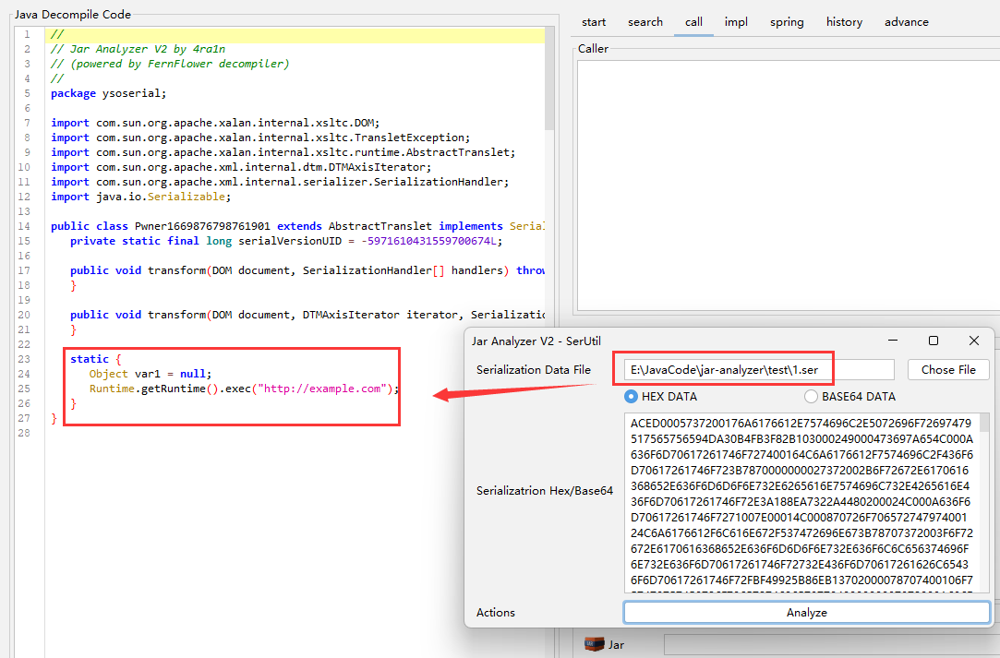

`Jar Analyzer 2.18` 版本以后支持 `HTTP API`

[示例图 1](img/0038.png) [示例图 2](img/0037.png)

`Jar Analyzer 2.19` 版本以后支持实时的 `CPU` 和内存占用分析

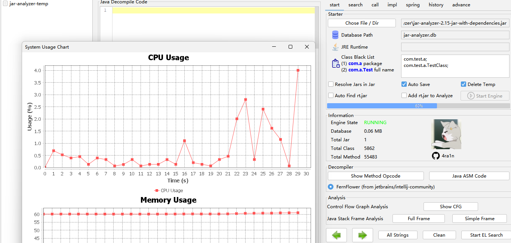

`Jar Analyzer 2.20` 版本后支持选中字符串全局高亮显示

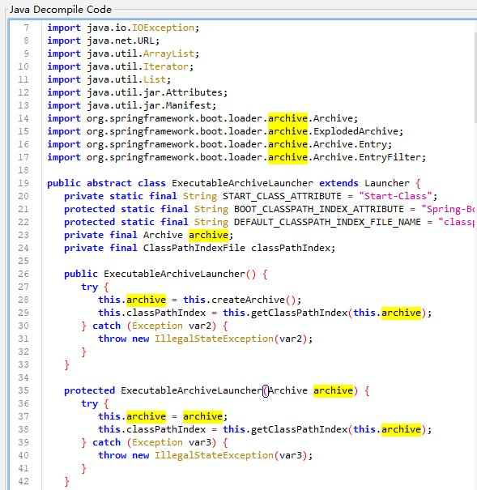

## 进阶功能

以上是基础功能，进阶和测试性的功能请参考：[进阶测试性功能](doc/README-advance.md)

例如类似 `OD/GDB` 的指令级 `GUI` 调试（未完成）

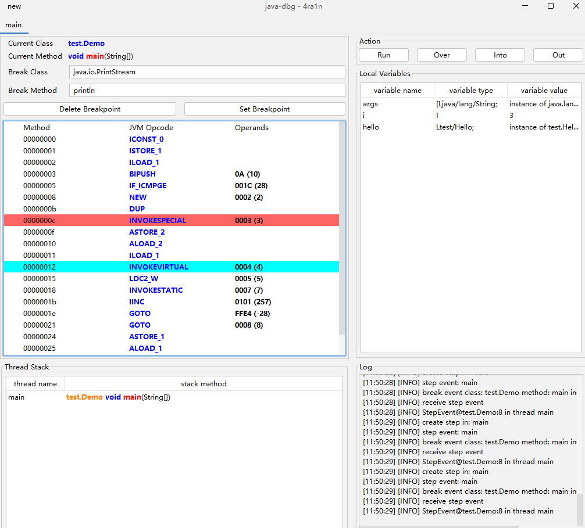

## 快捷键

- `CTRL+X` 方法交叉引用 快速跳转方法 `caller` 和 `callee` 页面
- `CTRL+F` 代码区域搜索 打开搜索面板 支持 `next` 和 `prev` 选项
- `CTRL+F` 文件树区搜索 显示搜索面板 搜索文件树中的类名以及内部类

## UI 主题

支持以下：

- default (默认使用 类似 `IDEA` 主题)
- metal
- win (仅 `Windows` 支持)
- win-classic (仅 `Windows` 支持)
- motif
- mac (仅 `MacOS` 支持)
- gtk (仅某些 `Linux` 支持)
- cross
- aqua (仅 `MacOS` 支持)
- nimbus

在启动时指定：`java -jar jar-analyzer.jar gui -t [theme]`

例如：`java -jar jar-analyzer.jar gui -t win-classic`

或者修改启动脚本的代码

```shell
set "theme_name=default"
```

## 注意

[文档](doc/README-note.md)

## 子项目

[文档](doc/README-sub.md)

## 其他

解释一些内部的原理和注意事项

[文档](doc/README-others.md)

## 参考

[文档](doc/README-thanks.md)

## API

[文档](doc/README-api.md)

## Thanks


This project is developed using JetBrains IDEA.
Thanks to JetBrains for providing me with a free license, which is a strong support for me.

## Star

<div align="center">


</div>
