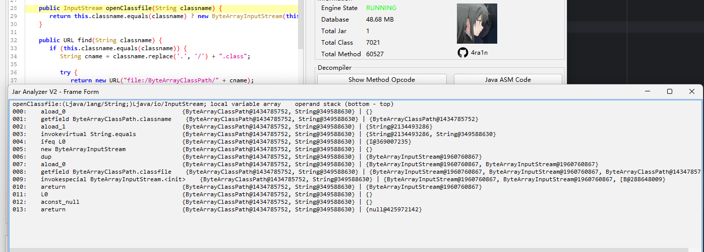
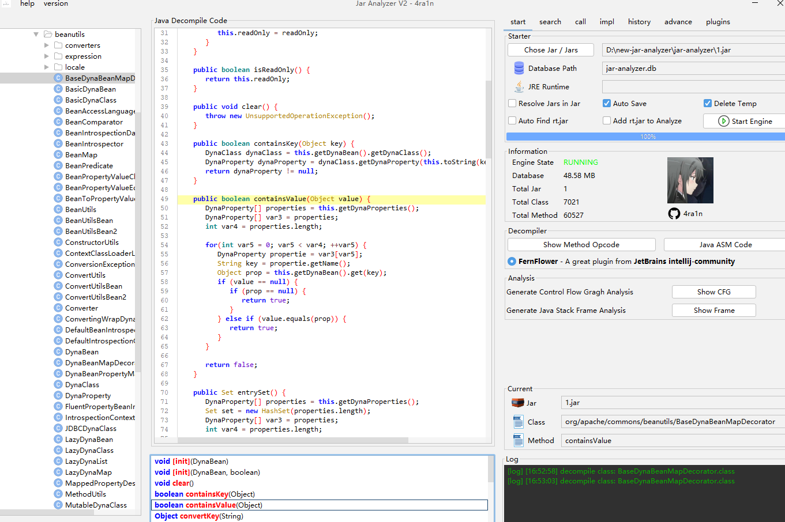
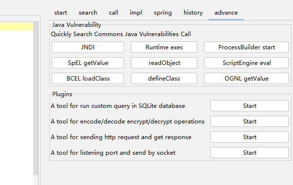
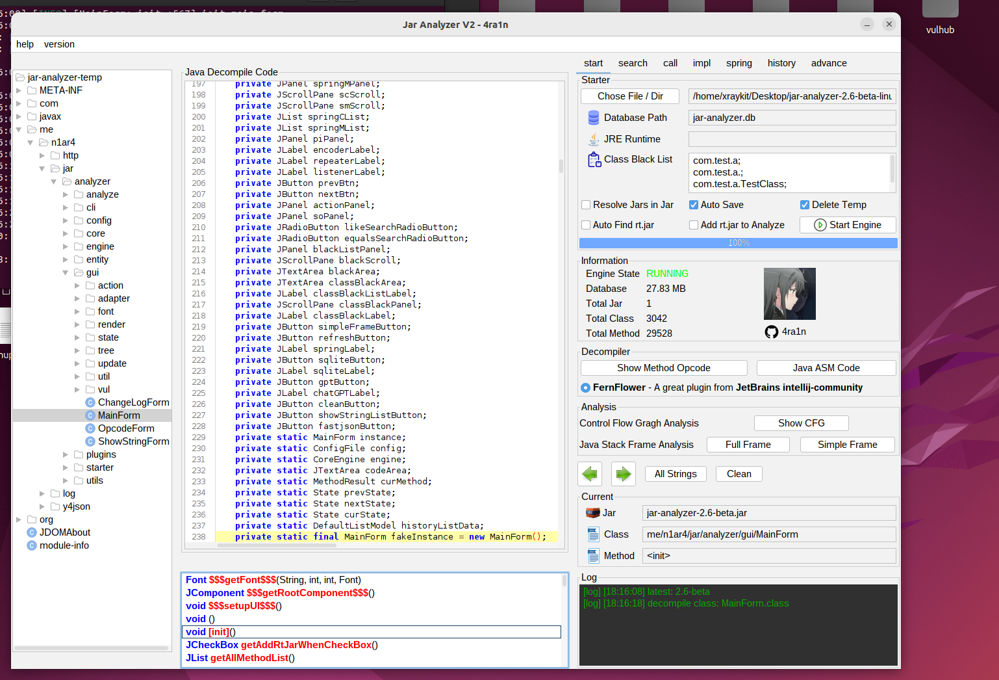

# Jar-Analyzer V2

[English Doc](doc/README-en.md)

[CHANGE LOG](src/main/resources/CHANGELOG.MD)


`Jar Analyzer` 是一个分析 `Jar` 文件的 `GUI` 工具：
- 支持大 `Jar` 以及批量 `Jars` 分析
- 方便地搜索方法之间的调用关系
- 分析 `LDC` 指令定位 `Jar` 中的字符串
- 一键分析 `Spring Controller/Mapping`
- 对于方法字节码和指令的高级分析
- 一键反编译，优化对内部类的处理
- 一键生成方法的 `CFG` 分析结果
- 一键生成方法的 `Stack Frame` 分析结果
- 远程分析 `Tomcat` 中的 `Servlet` 等组件
- 自定义 `SQL` 语句进行高级分析

更多的功能正在开发中

有问题和建议欢迎提 `issue`

[前往下载](https://github.com/jar-analyzer/jar-analyzer/releases/latest)

`Jar Analyzer` 的用途
- 场景1：从大量 `JAR` 中分析某个方法在哪个 `JAR` 里定义（精确到具体类具体方法）
- 场景2：从大量 `JAR` 中分析哪里调用了 `Runtime.exec` 方法（精确到具体类具体方法）
- 场景3：从大量 `JAR` 中分析字符串 `${jndi` 出现在哪些方法（精确到具体类具体方法）
- 场景4：从大量 `JAR` 中分析有哪些 `Spring Controller/Mapping` 信息（精确到具体类具体方法）
- 场景5：你需要深入地分析某个方法中 `JVM` 指令调用的传参（带有图形界面）
- 场景6：你需要深入地分析某个方法中 `JVM` 指令和栈帧的状态（带有图形界面）
- 场景7：你需要深入地分析某个方法的 `Control Flow Graph` （带有图形界面）
- 场景8：你有一个 `Tomcat` 需要远程分析其中的 `Servlet/Filter/Listener` 信息

## 一些截图

指令分析


`CFG` 分析


`JVM Stack Frame` 分析



带图形的 `Stack Frame` 分析


分析 `Spring Framework`


从 `2.8` 版本开始支持 `tomcat` 分析（一检查杀内存马）


自定义 `SQL` 语句任意分析


首页



方法调用搜索 (支持 `equals/like` 选项，支持黑名单过滤)


方法调用关系


一键分析，自定义 `SQL` 分析，其他插件等



在 `Ubuntu` 中使用的截图



## 注意事项

### 乱码问题

注意：
- 在 `Windows` 下请勿双击启动，请使用 `java -jar` 或双击 `bat` 脚本启动
- 如果使用 `java -jar` 启动乱码，请加入 `-Dfile.encoding=UTF-8` 参数

### 显示问题

本工具已经根据 `1080P` 适配 （考虑到绝大多数机器应该大于等于这个分辨率）

如果你的电脑在 `1080P` 下无法正常显示，请调整缩放到 `100%`

以 `Windows 11` 为例：右键显示设置


### 原理相关

本工具的基本原理：
- 解压所有 `Jar` 文件到 `jar-analyzer-temp` 目录
- 在当前目录构建数据库 `jar-analyzer.db` 文件
- 在当前目录新建文件 `.jar-analyzer` 记录状态


注意：当 `Jar` 数量较多或巨大时**可能导致临时目录和数据库文件巨大**

### 命令行使用

如果你不想使用 `GUI` 版本，本项目也支持命令行方式:

```text
Usage: java -jar jar-analyzer.jar [command] [command options]
  Commands:
    build      build database
      Usage: build [options]
        Options:
          --del-cache
            delete old cache
            Default: false
          --del-exist
            delete old database
            Default: false
          -j, --jar
            jar file/dir

    gui      start jar-analyzer gui
      Usage: gui
```

示例：对当前目录的 `test.jar` 进行分析和构建数据库，并删除缓存和当前目录旧数据库

```shell
java -jar jar-analyzer.jar build --jar 1.jar --del-cache --del-exist
```

### 视频演示

[B站视频教程](https://www.bilibili.com/video/BV1ac411S7q4/)

## Release 说明

在 `release` 中提供四种下载：
- `system` 使用系统 `JDK/JRE` 的启动脚本 (需要自行安装 `JRE`)
- `embed` 内置 `JRE` 的启动脚本 (无需另外安装一键启动)
- `linux` 内置 `shell` 启动脚本 (需要自行安装 `JRE`)
- 简单的 `Jar` 文件，不提供启动脚本

由于本工具仅在 `Windows` 中测试，其他操作系统可能会有未知的问题，欢迎提 `issue`

一般情况下，推荐使用内置 `JRE` 的 `embed` 版本启动

## 子项目

### Tomcat Analyzer

该项目原名`shell-analyzer`现改名`tomcat-analyzer`

(1) 第一步：检测进程并`Attach`


为了防止目标被恶意利用，需要输入一个密码

**注意：尽管使用了密码保护，但还是存在拒绝服务等风险，请勿在生产环境使用，目前适用于自己搭建靶机分析学习**

(2) 第二步：勾选并分析

点击**刷新**即可获得实时的数据

(3) 双击任意一个类即可`Dump`并反编译

(4) 复制类名过去即可修复内存马


一些原理


### Y4-HTTP

该项目位于`me.n1ar4.http`中，这是一个手动构造和解析`HTTP/1.1`协议的`HTTP`客户端库

[代码](src/main/java/me/n1ar4/http)

### Y4-JSON

该项目位于`me.n1ar4.y4json`中，这是一个模仿`Fastjson API`定义的简单的`JSON`序列化和反序列化库

[代码](src/main/java/me/n1ar4/y4json)

### Y4-LOG

该项目位于`me.n1ar4.log`中，这是一个模仿`Log4j2 API`的日志库

[代码](src/main/java/me/n1ar4/log)

## 如何构建

构建一般基于 `Java 8`
- 下载 `JDK 8`
- 使用 `Maven` (https://maven.apache.org/download.cgi)
- 使用 `Python 3` 辅助 (https://www.python.org/downloads/)

步骤：

(1) mvn -B package -DskipTests --file pom.xml

(2) python build.py

(3) 复制 JRE 到 embed 版

## 其他

如果你希望体验老版本 (不再维护) 的 `Jar Analyzer` 可以访问：
- https://github.com/4ra1n/jar-analyzer-cli
- https://github.com/4ra1n/jar-analyzer-gui

为什么我不选择 `IDEA` 而要选择 `Jar Analyzer V2` 工具：
- 因为 `IDEA` 不支持分析无源码的 `Jar` 包
- 本工具有一些进阶功能是 `IDEA` 不支持的 (指令/CFG/Stack分析)

(1) 什么是方法之间的关系

```java
class Test{
    void a(){
        new Test().b();
    }
    
    void b(){
        Test.c();
    }
    
    static void c(){
        // code
    }
}
```

如果当前方法是 `b`

对于 `a` 来说，它的 `callee` 是 `b`

对于 `b` 来说，它的 `caller` 是 `a`

(2) 如何解决接口实现的问题

```java
class Demo{
    void demo(){
        new Test().test();
    }
}

interface Test {
    void test();
}

class Test1Impl implements Test {
    @Override
    public void test() {
        // code
    }
}

class Test2Impl implements Test {
    @Override
    public void test() {
        // code
    }
}
```

现在我们有 `Demo.demo -> Test.test` 数据, 但实际上它是 `Demo.demo -> TestImpl.test`.

因此我们添加了新的规则： `Test.test -> Test1Impl.test` 和 `Test.test -> Test2Impl.test`.

首先确保数据不会丢失，然后我们可以自行手动分析反编译的代码
- `Demo.demo -> Test.test`
- `Test.test -> Test1Impl.test`/`Test.test -> Test2Impl.test`

(3) 如何解决继承关系

```java
class Zoo{
    void run(){
        Animal dog = new Dog();
        dog.eat();
    }
}

class Animal {
    void eat() {
        // code
    }
}

class Dog extends Animal {
    @Override
    void eat() {
        // code
    }
}

class Cat extends Animal {
    @Override
    void eat() {
        // code
    }
}
```
`Zoo.run -> dog.cat` 的字节码是 `INVOKEVIRTUAL Animal.eat ()V`, 但我们只有这条规则 `Zoo.run -> Animal.eat`, 丢失了 `Zoo.run -> Dog.eat` 规则

这种情况下我们添加了新规则： `Animal.eat -> Dog.eat` 和 `Animal.eat -> Cat.eat`

首先确保数据不会丢失，然后我们可以自行手动分析反编译的代码
- `Zoo.run -> Animal.eat`
- `Animal.eat -> Dog.eat`/`Animal.eat -> Cat.eat`

## 致谢

感谢以下项目提供的思路和代码
- https://github.com/JetBrains/intellij-community/tree/master/plugins/java-decompiler/engine
- https://github.com/bobbylight/RSyntaxTextArea
- https://github.com/JackOfMostTrades/gadgetinspector
- https://github.com/lsieun/learn-java-asm
