# Jar-Analyzer

[CHANGE LOG](src/main/resources/CHANGELOG.MD)

`jar-analyzer` 项目连续 `5` 年更新，共发布 `65` 个版本（含 `v1` 和 `v2` 版本）完全开源，完全免费

The `jar-analyzer` project has been continuously updated for `5` years, with `65` versions released, contains v1 and v2 version, completely open source and completely free.


官方文档：https://docs.qq.com/doc/DV3pKbG9GS0pJS0tk

如果贡献代码：fork 本项目到自己仓库，参考 [build](#build) 部分搭建项目，提交 Pull Requests 即可

感谢以下贡献者（排名不分先后）

<p>
  <a href="https://github.com/4ra1n"></a>
  <a href="https://github.com/whwlsfb"></a>
  <a href="https://github.com/0cat-r"></a>
  <a href="https://github.com/Gosiu"></a>
  <a href="https://github.com/ly-test-fuzz"></a>
  <a href="https://github.com/AII12754"></a>
  <a href="https://github.com/sensensen404"></a>
  <a href="https://github.com/MyDynasty"></a>
  <a href="https://github.com/TianMing2018"></a>
  <a href="https://github.com/hacats"></a>
  <a href="https://github.com/R0ser1"></a>
  <a href="https://github.com/su18"></a>
  <a href="https://github.com/7-e1even"></a>
  <a href="https://github.com/L-codes"></a>
  <a href="https://github.com/osword"></a>
</p>

一些真实的用户使用评价和反馈，参考 [用户评价](#用户评价)

Jar Analyzer

- 一个 `JAR` 包分析工具，`AI` 赋能古法安全审计
- 支持 `JAR DIFF` 深入分析源码变动（支持目录对比）
- 自从 `6.0` 版本后内置 `AI` 助手和 `MCP`
- 完善美观的 `GUI` 支持（现代化 `Java GUI` 界面，可拖拽，明暗橙三主题，十种风格）
- 基础分析（支持 `Jar/War/Classes` 输入，支持多文件，支持嵌套 `FatJar`）
- 黑白名单配置（构建数据库和搜索功能都支持黑白名单过滤，支持精确类名和包名过滤）
- 反编译（内置 `Fernflower` 改进版本双击反编译，使用 `JavaParser` 精确定位方法位置）
- 方法调用关系搜索（构建方法调用关系数据库，可搜方法定义与方法引用，支持精确和模糊搜索）
- 方法调用链 `DFS` 算法分析（支持 **正向/反向** 调用链分析，基于 `DFS` 算法的深度调用链追踪）
- 简单的模拟 `JVM` 污点分析实现，可验证 `DFS` 算法推导方法调用链可行性（beta）
- 字符串搜索（搜索 `LDC` 指令，支持模糊搜索和精确搜索，可定位具体方法，联动调用进行分析）
- `Java Web` 组件入口分析（`Java Servlet/Filter` 组件分析，`Spring` 入口信息一键分析）
- `CFG` 程序分析（方法内部控制流可视化，基本块划分与展示，异常处理流程分析）
- `JVM` 栈帧分析（局部变量表与操作数栈状态跟踪，运行时数据流静态分析）
- 自定义表达式搜索（基于 `SpEL` 的多种语法组合搜索，用于搜索漏洞 `Gadget` 等）
- 常见安全分析功能（支持简单的 `SCA` 分析，敏感信息泄漏分析，可能的 `gadget` 分析）

设计架构：

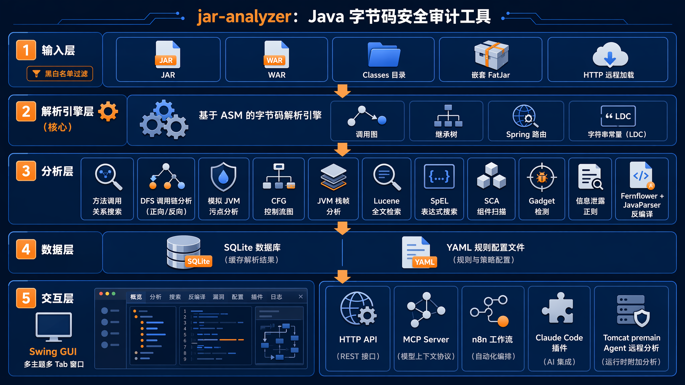

相关项目：

- 核心引擎：https://github.com/jar-analyzer/jar-analyzer-engine
- `claude code` 插件：https://github.com/jar-analyzer/jar-analyzer-claude

为什么选择 Jar Analyzer 

- 简单易上手，相比 `codeql/tabby` 简化很多，足够应对 `90%` 场景
- 完善且美观的 `GUI` 设计， 只需鼠标点点点，即可进行大多数的代码审计
- 内置常见的 `source` 入口分析，支持动态的 `sink` 配置文件规则，方便快捷
- 代码完全开源，构建基于 `github actions` 你可以随意查看功能代码，定制功能
- 简单易用无需额外配置的 `污点分析` 能力，帮助您进行深入的漏洞和程序分析
- 活跃的开源社区和维护，常年持续更新完善，欢迎贡献和参与
- 本项目跟随主流技术路线，尝试基于 `AI` 做探索

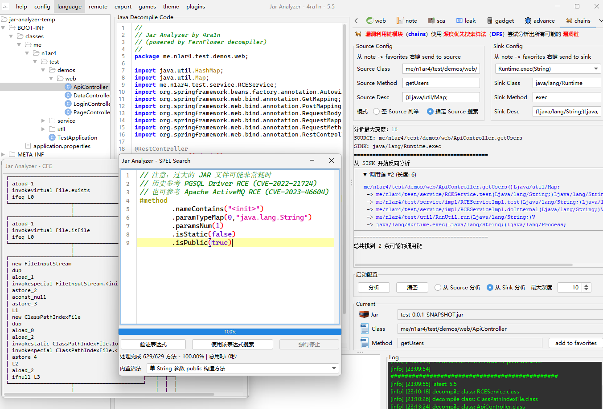

## 快速开始

(1) 下载

所有可供下载的文件由 `Github Actions` 构建

一般情况建议从 `Github Release` 页面下载：[下载地址](https://github.com/jar-analyzer/jar-analyzer/releases/latest)

`6.0` 版本也提供了 `蓝奏云` 的下载地址：

- [jar-analyzer-6.0-windows-system.zip](https://jar-analyzer.lanzout.com/ipTAj3sr1lde)
- [jar-analyzer-6.0-windows-full.zip](https://jar-analyzer.lanzout.com/i2ClC3sr1jva)
- [jar-analyzer-6.0-windows-25.zip](https://jar-analyzer.lanzout.com/ibzlS3sr1hna)
- [jar-analyzer-6.0.zip](https://jar-analyzer.lanzout.com/iurpu3sr1ecb)

(2) 你是 `Java` 老手

- 选择 `JAR` 分析结束后，人工搜索 `sink` 逐步跟调用，内部集成了众多常见的 `Java` 漏洞 `sink`
- `Java WEB` 入口分析：支持 `Spring Controller/Serlvet` 等常见入口点定位和导出，辅助分析
- 自动化分析，支持 `DFS` 调用链分析，支持模拟 `JVM` 的污点分析，人工经验结合自动化，进阶分析
- 信息泄露分析：帮你找到 `JAR` 包中所有静态资源文件和 `class` 中的敏感信息，内置 `AI` 研判
- 更多专业级功能：支持 `DIFF JAR` 以及目录对比，功能更新分析，漏洞补丁分析，内置 `AI` 研判

(3) 不了解 `Java` 也想审计

- 选择 `JAR` 分析结束后，点开 `MCP` 面板，一键启动 `MCP`
- 在 `Claude Code / Codex / Qwen Code / ZCode` 等工具中完成 `MCP` 配置
- 对话：请使用 `jar-analyzer-mcp` 分析漏洞吧
- 可选：让 `AI` 帮你写一个针对 `jar-analyzer-mcp` 的 `SKILL` 进行辅助分析

## 近期更新

自从 `5.21` 版本以后支持了 `JAR DIFF` 功能，在 `5.22` 版本支持导出完整记录，便于 `AI` 分析漏洞

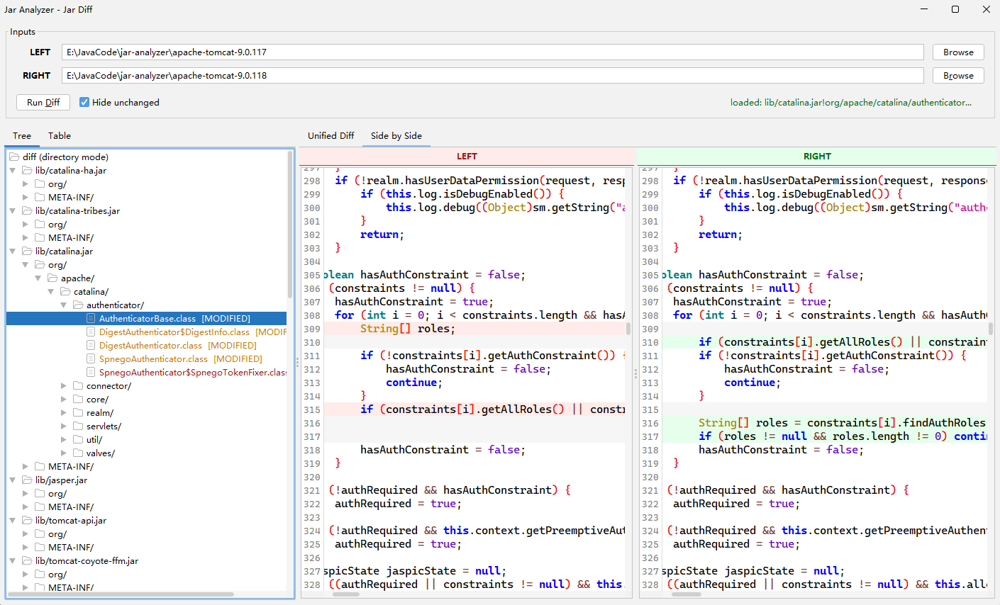

自从 `6.0` 版本以后，内置了 `MCP` 面板，可以轻松配置和启动，支持 `SSE/Streamable HTTP`

`Agent` 端配置参考 [MCP 配置](#MCP)

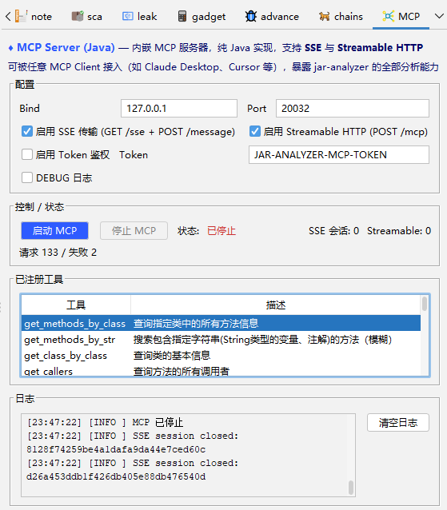

自从 `6.0` 版本以后，内置了 `AI` 助手和 `workflow` 内容，详情参考 [AI 文档](doc/README-ai.md)

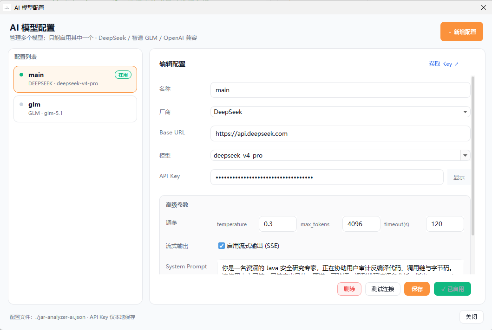

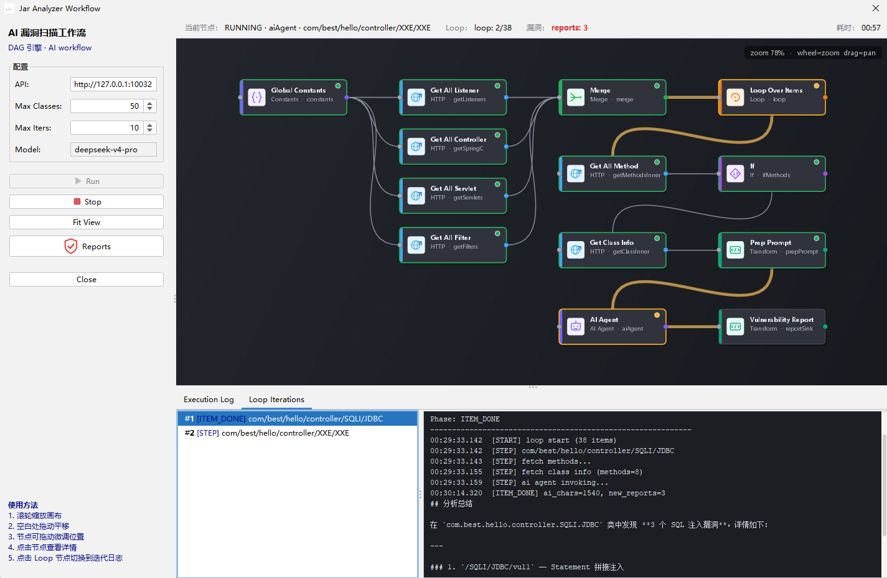

静态分析 `spring / java web` 项目

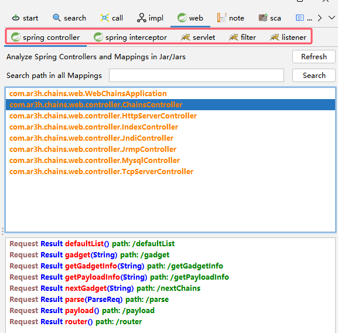

一键快速搜索（自从 `4.0` 版本后支持通过配置动态生成 `GUI` 按钮）

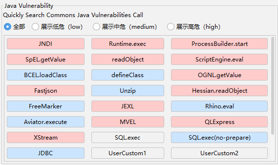

例如一个 `Runtime.exec` 的动态规则（配好后直接生成按钮和搜索逻辑）

```yaml
  Runtime.exec:
    - !!me.n1ar4.jar.analyzer.engine.SearchCondition
      className: java/lang/Runtime
      methodName: exec
      methodDesc: null
```

自从 `5.3` 版本后支持深度优先搜索算法自动分析漏洞链

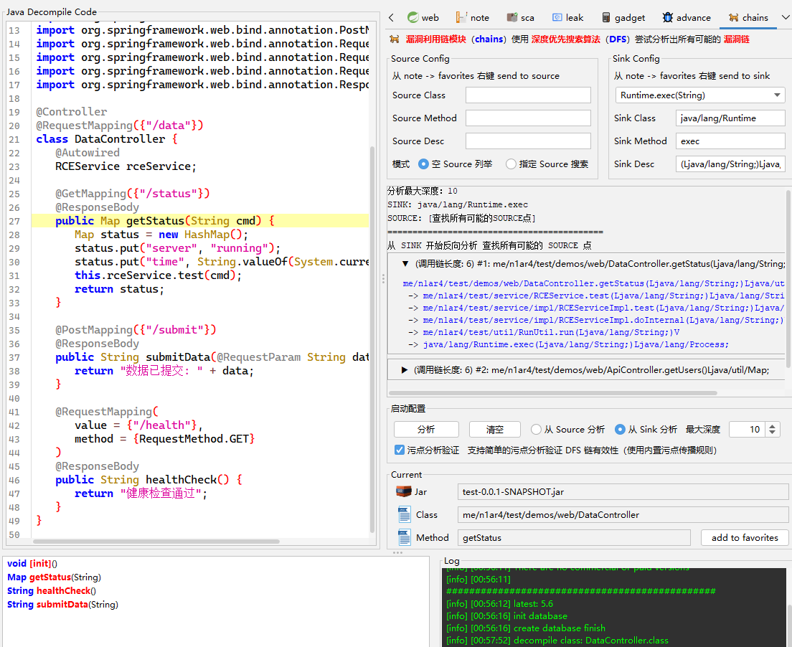

自从 `5.7` 版本后支持简单的模拟 `JVM` 污点分析验证 `DFS` 结果（勾选污点分析验证即可）

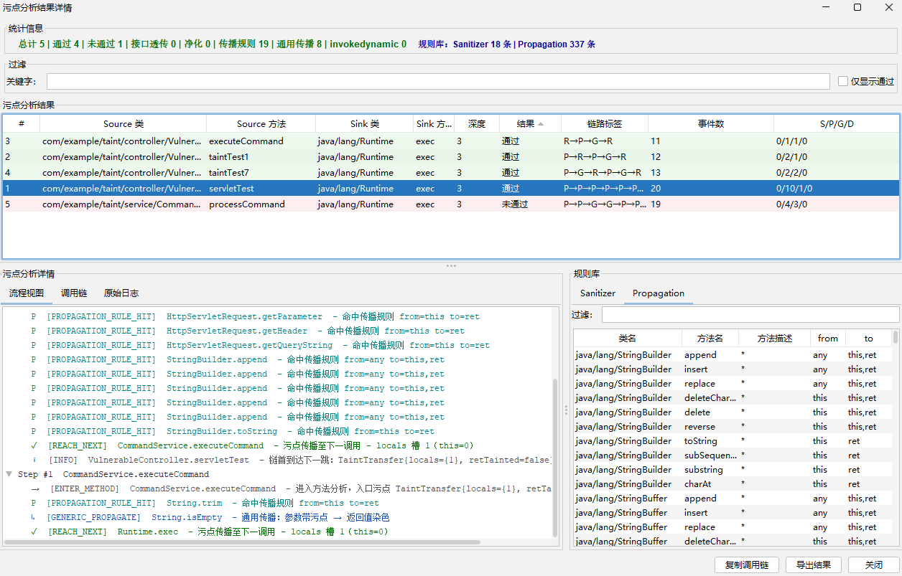

自从 `5.22` 版本后大幅改进了表达式搜索功能

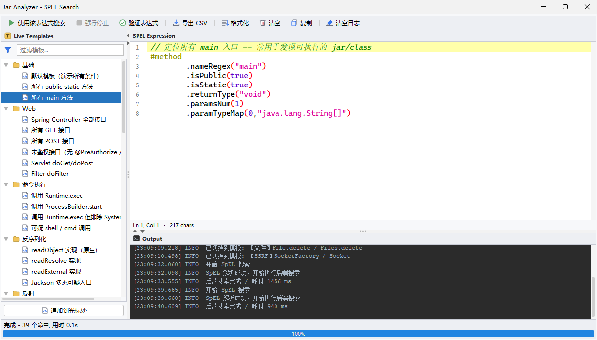

## 常见用途

- 场景01：从大量 `JAR` 中分析某个方法在哪个 `JAR` 里定义（精确到具体类具体方法）
- 场景02：从大量 `JAR` 中分析哪里调用了 `Runtime.exec` 方法（精确到具体类具体方法）
- 场景03：从大量 `JAR` 中分析字符串 `${jndi` 出现在哪些方法（精确到具体类具体方法）
- 场景04：从大量 `JAR` 中分析有哪些 `Spring Controller/Mapping` 信息（精确到具体类具体方法）
- 场景05：从大量 `JAR` 中分析是否存在 `Apache Log4j2` 漏洞（匹配所有 `CVE` 漏洞）
- 场景06：从大量 `JAR` 中分析是否有使用 `FASTJSON 47/68/80` 等存在漏洞的版本
- 场景07：从大量 `JAR` 中分析各种常见的 `Java` 安全漏洞调用出现在哪些方法
- 场景08：你需要深入地分析某个方法中 `JVM` 指令调用的传参（带有图形界面）
- 场景09：你需要深入地分析某个方法中 `JVM` 指令和栈帧的状态（带有图形界面）
- 场景10：你需要深入地分析某个方法的 `Control Flow Graph` （带有图形界面）
- 场景11：你有一个 `Tomcat` 需要远程分析其中的 `Servlet/Filter/Listener` 信息
- 场景12：你有一个序列化数据里面包含了恶意的 `Class` 字节码需要一键提取分析
- 场景13：你有一个 `BCEL` 格式的字节码需要一键反编译代码分析
- 场景14：你有一大堆 `Jar` 文件或目录需要全部批量反编译导出代码
- 场景15：从大量 `JAR` 中分析 `IP` 地址/手机号/邮箱等各种信息泄露
- 场景16：需要将 `JAR` 分析加入到已有的工作流（`CICD` / `AI workflow` 等） 
- 场景17：需要 `DIFF` 两个 `JAR/目录` 的文件变动分析漏洞修复补丁等
- 测试功能：字节码指令级别的调试

## 更新记录

[详细更新日志 - CHANGE LOG](src/main/resources/CHANGELOG.MD)

有问题和建议欢迎提 `issue` 更多的功能正在开发中 [前往下载](https://github.com/jar-analyzer/jar-analyzer/releases/latest)

## 用户评价

(01) 我发现 `jar-analyzer` 性能方面很出色（某知名安全研究员）

(02) 某些场景 `jar-analyzer` 的表达式功能比 `codeql` 更好用（某安全研究员）

(03) 我使用 `jar-analyzer` 挖了不少的 `0 day` 漏洞，推荐使用 (某知名安全研究员)

(04) 大佬的 `jar-analyzer` 很好用 （某乙方安全工程师）

(05) 师傅的 `jar-analyzer` 太强了 （某知名安全研究员）

(06) 刚才老板大力表扬了 `jar-analyzer` 说超级好用（某甲方安全工程师）

(07) 大佬，先说一句 `jar-analyzer` 真好用（某乙方安全工程师）

(08) `jar-analyzer` 最好用（某乙方安全工程师）

(09) `Java` 漏洞挖掘神器 `jar-analyzer`（某乙方安全工程师）

(10) 我用 `jar-analyzer` 辅助挖到了价值 `10w` 的 `0 day`（某年入百万安全研究员）

(11) `jar-analyzer` 可以快速筛选符合的 `gadget` 辅助挖掘新链（知名项目 `java-chains` 创始人）

(12) `jar-analyzer` 在手 `java` 漏洞不愁（某安全公司总裁）

(13) 拼尽全力，无法战胜（某大甲方安全工程师，有丰富的代码审计和 `SAST` 工具开发经验）

(14) 这几天已经用这个挖到了几个洞了，对于新手很友好（某安全工程师）

(15) `DFS` 漏洞利用链分析功能完整，用起来比 `tabby` 和 `codeql` 都要简单（某安全工程师）

(16) 使用 `jar-anlyzer mcp` 配合 `n8n` 工作流，确实能挖到洞 (某安全专家)
 
## MCP

在使用 `MCP` 之前，请确保你已经完成了分析，成功构建了数据库

然后前往 `MCP` 面板点击 `启动 MCP` 即可

支持 `SSE`

```json
{
  "mcpServers": {
    "jar-analyzer-mcp": {
      "type": "sse",
      "url": "http://127.0.0.1:20032/sse"
    }
  }
}
```

支持 `Streamable HTTP`

```json
{
  "mcpServers": {
    "jar-analyzer-mcp": {
      "type": "http",
      "url": "http://127.0.0.1:20032/mcp"
    }
  }
}
```

## 表达式

表达式搜索是 `jar-analzyer` 重要的高级功能：可以自定义多种条件组合搜索方法

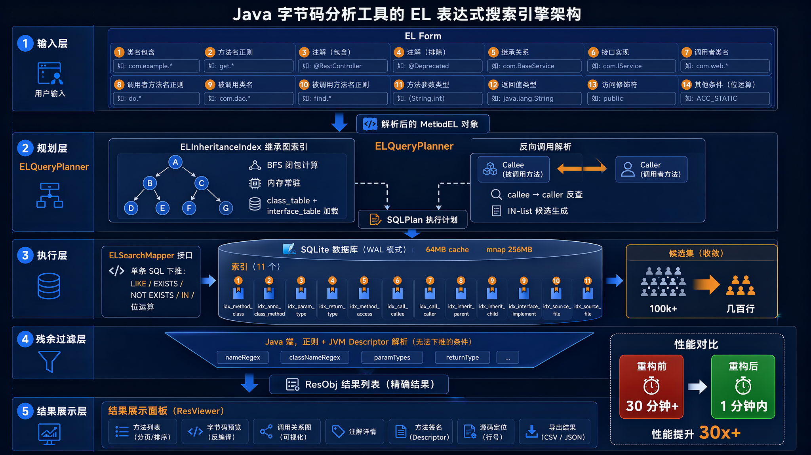

表达式搜索位于首页以及 `Advance` 的 `Plugins` 部分

[详细文档](doc/README-el.md)

## 感谢列表

- 4ra1n (https://github.com/4ra1n) (项目作者) 
- whw1sfb (https://github.com/whwlsfb) (第一次贡献，重要 AI 贡献)
- 0cat (https://github.com/0cat-r) (重要 AI 贡献)
- Honey Baby (https://github.com/Gosiu) (多次重要贡献) 
- fantasy (https://github.com/ly-test-fuzz) 
- AII (https://github.com/AII12754)
- phil (https://github.com/sensensen404)
- MyDynasty (https://github.com/MyDynasty) 
- TianMing2018 (https://github.com/TianMing2018) 
- hacats (https://github.com/hacats) 
- R0ser1 (https://github.com/R0ser1) 
- su18 (https://github.com/su18) 
- 7eleven (https://github.com/7-e1even)
- L-codes (https://github.com/L-codes) (AI 贡献)
- osword (https://github.com/zhzhdoai) (AI 贡献)

感谢以下用户的赞赏和支持

| 用户ID | 赞赏金额 |
|--------|--------|
| GGBond | 50     |
| xrayl  | 50     |

## 时间

- `Jar Analyzer V1` 最初版诞生于 `2022.11.27`
- `Jar Analyzer V2` 在 `2023.10.23` 第一次提交
- `Jar Analyzer v2` 正式版在 `2023.12.07` 发布
- `Jar Analyzer V2` 在 `2024.08.15` 发布 `3.0` 版本
- `Jar Analyzer V2` 在 `2024.09.30` 总 `Star` 破千
- `Jar Analyzer V2` 在 `2024.11.07` 发布 `4.0` 版本
- `Jar Analyzer V2` 在 `2025.01.07` 日下载量破万
- `Jar Analyzer V2` 在 `2025.04.28` 发布 `5.0` 版本
- `Jar Analyzer` 在 `2026.03.19` 发布 `engine` 子项目
- `Jar Analyzer` 在 `2026.03.21` 发布 `claude code` 插件
- `Jar Analyzer V2` 在 `2026.03.23` 总 `Star` 破两千
- `Jar Analyzer V2` 在 `2026.06.23` 发布 `6.0` 版本

## 性能测试

参考 [性能测试文档](doc/README-test.md) 对比分析 `G1GC` 和 `ZGC` 情况

## BUILD

注意：首先对你的 `IDEA` 进行设置（本项目不支持 `Eclipse/VS Code` 等 `IDE` 环境）

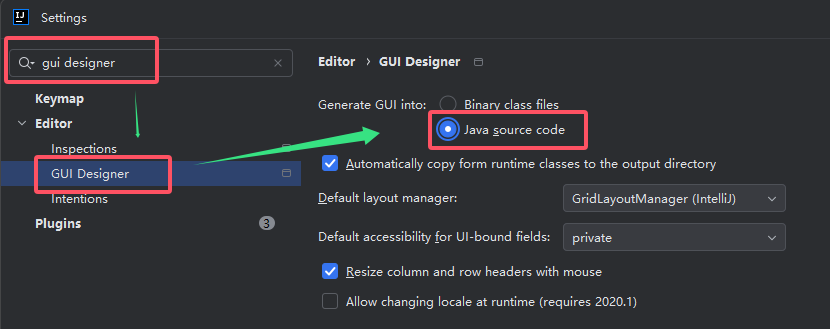

注意：过高版本的 `IDEA` 可能删除了该功能，可以在插件市场搜索 `Swing UI Designer` 安装

编译和构建过程如下：（以 `Windows` 为例其他环境类似）

由于 `jar-analyzer` 历史提交过大，请使用 `--depth 1` 加速克隆

```shell
git clone --depth 1 https://github.com/jar-analyzer/jar-analyzer
```

核心项目构建

1. 重要：确保你安装了 `JDK 8 64位` （建议 `OpenJDK`）
2. 重要：如果你修改了代码请确保在 `IDEA` 环境中至少启动一次（生成 `GUI` 代码）
3. 重要：确保你安装了 `Maven 3.X` （一般 `IDEA` 已自带）
4. 可选：完善贡献者信息：检查修改 `thanks.md/thanks.txt` 和 `pom.xml`
5. 可选：使用 `cmake` 构建 `native` 目录生成 `dll` 文件放入 `resources`

其他组件构建

1. 可选：构建 `agent` 子项目 `cd agent && package.bat`
2. 可选：使用 `winres` 和 `gcc` 构建启动 `exe` 文件和图标信息
3. 可选：完整发版参考 `build.py` 和 `build.yml` 文件

## AI 相关内容

`AI` 相关功能文档：[README-ai.md](doc/README-ai.md)

## 注意

[文档](doc/README-note.md)

## 子项目

[文档](doc/README-sub.md)

## 其他

早期文章视频以及解释一些内部的原理和注意事项

[文档](doc/README-others.md)

## 参考

[文档](doc/README-thanks.md)

## API

[文档](doc/README-api.md)

## 安全公告

- [\[GHSA-43rf-3hm4-hv5f\] 反编译恶意的 CLASS 文件可能导致程序不可用](https://github.com/jar-analyzer/jar-analyzer/security/advisories/GHSA-43rf-3hm4-hv5f)
- [\[GHSA-x5h2-78p8-w943\] Jar Analyzer 2.13 版本之前存在 SQL 注入漏洞](https://github.com/jar-analyzer/jar-analyzer/security/advisories/GHSA-x5h2-78p8-w943)
- [\[GHSA-jmcg-r2c5-7m29\] Jar Analyzer 存在 ZIP SLIP 漏洞（最坏情况可导致 RCE 风险）](https://github.com/jar-analyzer/jar-analyzer/security/advisories/GHSA-jmcg-r2c5-7m29)
- [\[GHSA-h6vc-3rcp-p7qp\] 表达式分析功能中的 SpEL 注入漏洞可导致远程代码执行](https://github.com/jar-analyzer/jar-analyzer/security/advisories/GHSA-h6vc-3rcp-p7qp)

不再接受用户的输入导致的安全问题，除非恶意的输入 `class/jar` 文件可能导致的安全问题

不再接收 `GUI` 中可能的漏洞，不认为通过 `Webswing` 等方式暴露到 `web` 端会产生漏洞

注意：当 `Jar` 数量较多或巨大时 **可能导致临时目录和数据库文件巨大** 请确保足够的空间

有 `UI` 兼容性问题请查看 `ISSUE` 部分的置顶

## Star

<div align="center">


</div>
