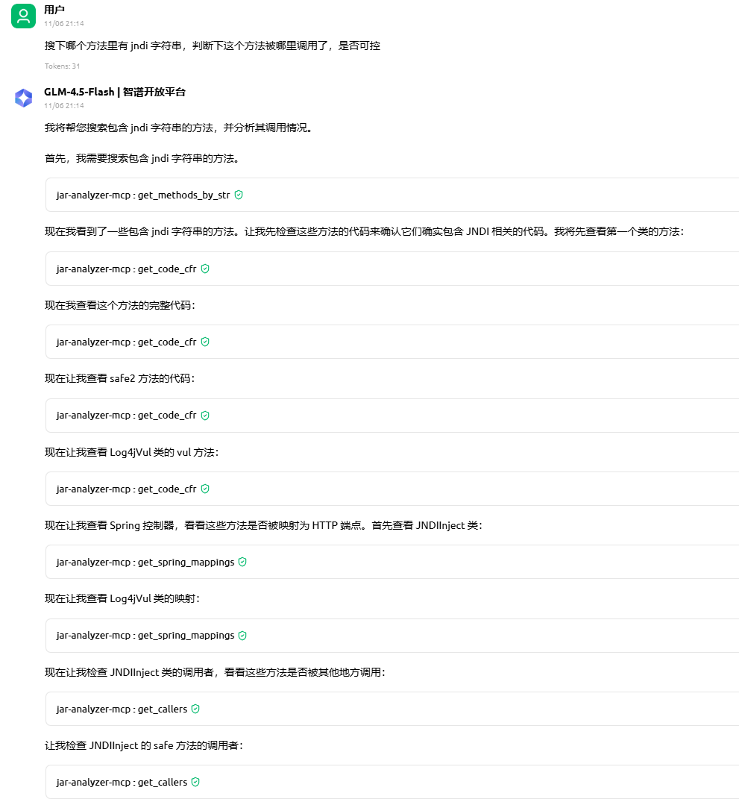
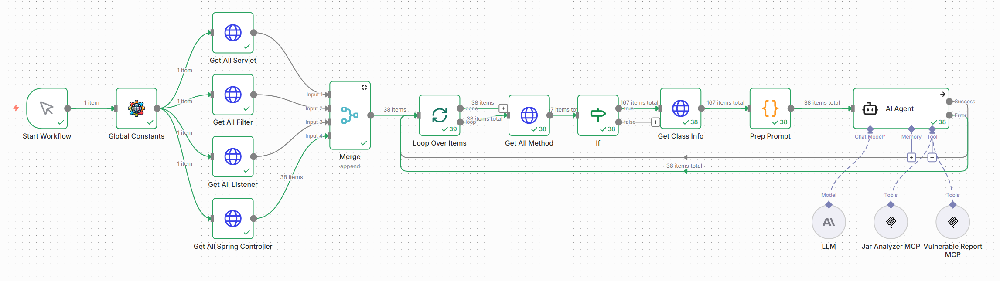
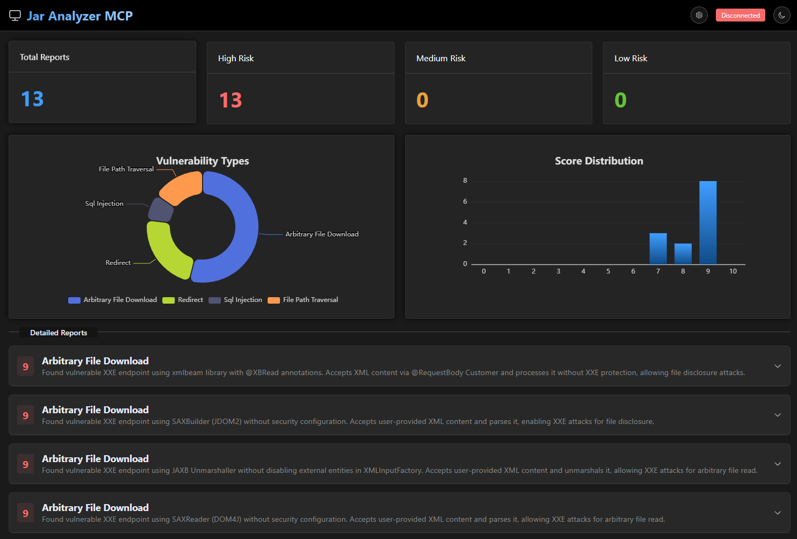
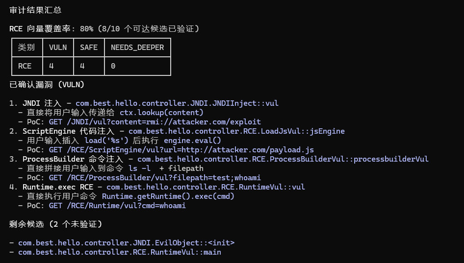

## AI 相关

自从 `5.10` 版本后支持 `MCP` 请参考文档 [MCP](../mcp-doc/README.md)

结合 `jar-analyzer mcp` 可以在 `n8n` 平台使用，文档：[n8n-doc](../n8n-doc)

使用 `jar-audit-agent` skill 配合 `jar-analyzer` 进行 `Java` 代码审计

该功能正在开发中，不够稳定和完善，欢迎尝试使用，一起优化：[文档](../skills)

感谢 0cat https://github.com/0cat-r

