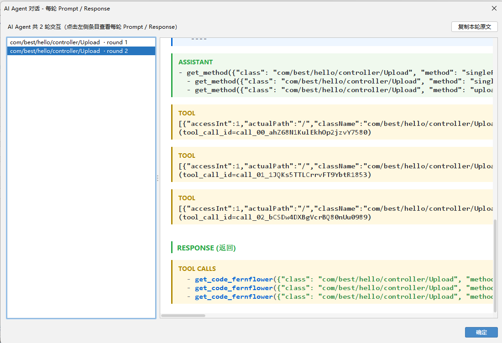
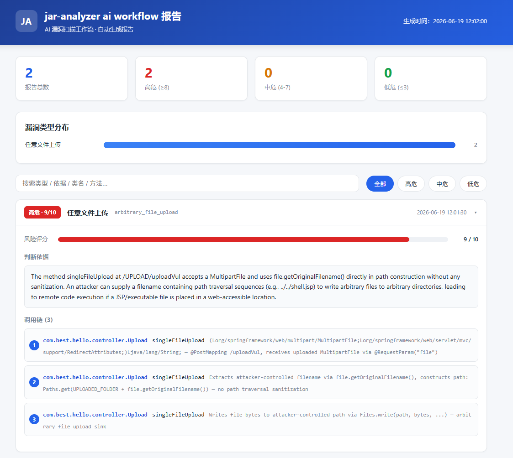
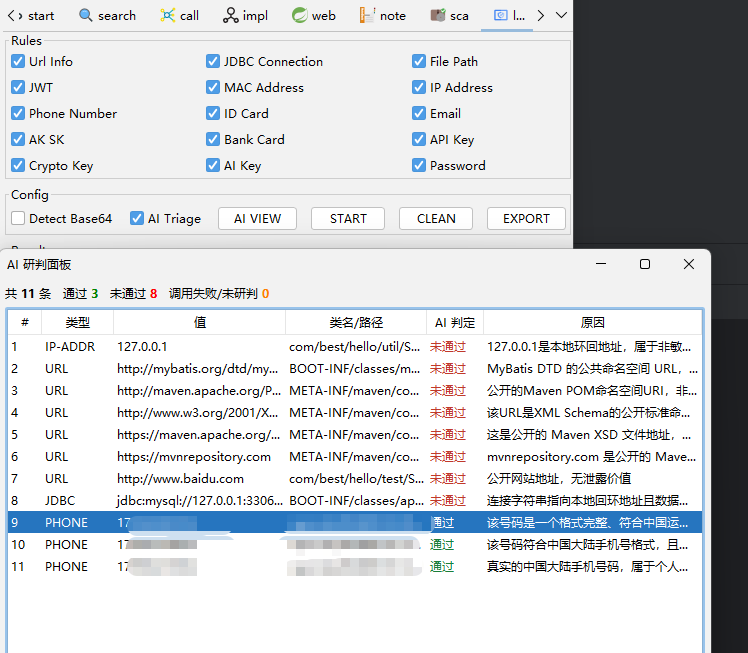
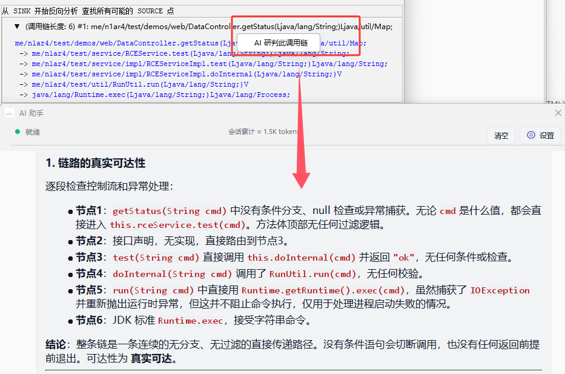
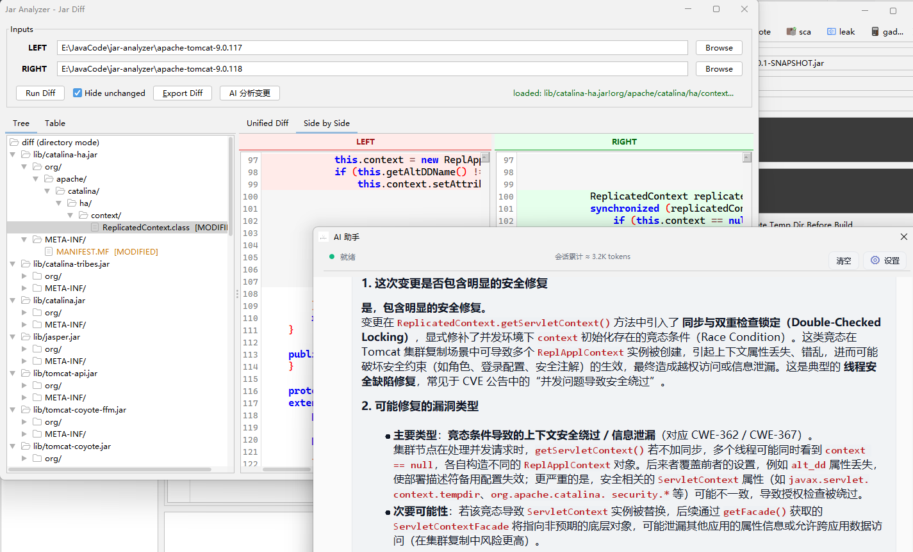

## AI 相关

自从 `6.0` 版本以后，内置了 `MCP` 面板，可以轻松配置和启动，支持 `SSE/Streamable HTTP`

自从 `6.0` 版本以后，内置了 `AI` 助手（支持 `DeepSeek` 和 `GLM` 快速配置）

纯 `Java Swing` 实现的 `workflow`

信息泄露 `AI` 研判

漏洞链 `DFS` 分析使用 `AI` 研判

`DIFF` 分析是否有安全修复 `AI` 研判

