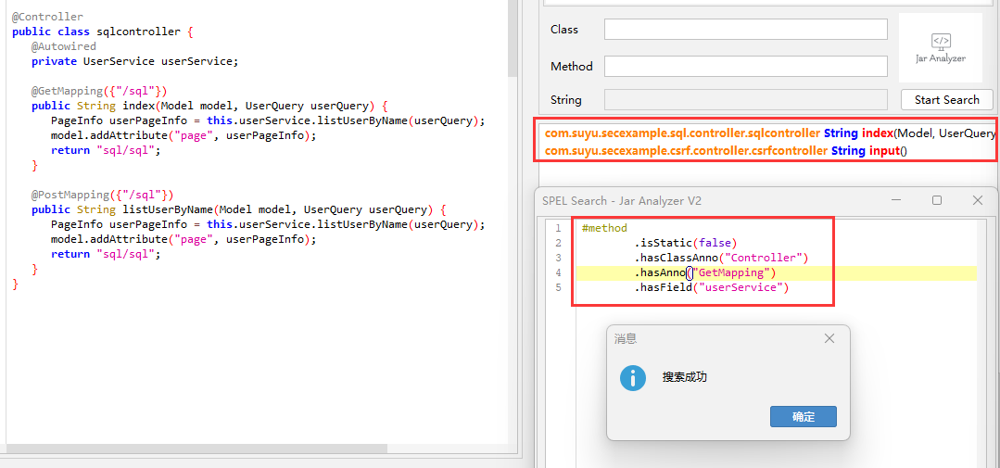

## 表达式搜索

在 `2.12` 版本以后支持超强的表达式搜索，可以随意组合以搜索你想要的信息

由于该功能从 `Jar Analyzer V1` 版本迁移过滤，老版本使用内存数据库效率较高，新版使用 `sqlite` 查询速度会降低

| 表达式               | 参数         | 作用       | 
|:------------------|:-----------|:---------|
| nameContains      | String     | 方法名包含    |
| startWith         | String     | 方法前缀     |
| endWith           | String     | 方法后缀     |
| classNameContains | String     | 类名包含     |
| returnType        | String     | 方法返回类型   |
| paramTypeMap      | int String | 方法参数对应关系 |
| paramsNum         | int        | 方法参数个数   |
| isStatic          | boolean    | 方法是否静态   |
| isSubClassOf      | String     | 是谁的子类    |
| isSuperClassOf    | String     | 是谁的父类    |
| hasAnno           | String     | 方法的注解    |
| excludeAnno       | String     | 排除方法的注解  |
| hasClassAnno      | String     | 类的注解     |
| hasField          | String     | 类字段      |

注意：
- `returnType`和`paramTypeMap`要求类似是完整类名，例如`java.lang.String`，基础类型直接写即可例如`int`
- `isSubClassOf`和`isSuperClassOf`要求完整类名，例如`java.awt.Component`
- `hasAnno`和`hasClassAnno`不要求完整类名，直接写即可例如`Controller`

### 1.基础搜索

搜索的基础是方法，你希望搜索怎样的方法

例如我希望搜索方法名以`set`开头并以`value`结尾的方法

```java
#method
        .startWith("set")
        .endWith("value")
```

例如我希望搜索类名包含`Context`且方法名包含`lookup`的方法

```java
#method
        .nameContains("lookup")
        .classNameContains("Context")
```

例如我希望搜索返回`Process`类型共3个参数且第二个参数为`String`的方法

```java
#method
        .returnType("java.lang.Process")
        .paramsNum(3)
        .paramTypeMap(1,"java.lang.String")
```

### 2.子类与父类

比如我们想找`javax.naming.spi.ObjectFactory`的所有子类（包括子类的子类等）

编写以下规则即可，程序内部会递归地寻找所有的父类

```java
#method
        .isSubClassOf("javax.naming.spi.ObjectFactory")
```

如果想找某个类的所有父类，使用`isSuperClassOf`即可（注意全类名）

注意以上会直接找到所有符合条件类的所有方法，所以我建议再加一些过滤

例如

```java
#method
        .isSubClassOf("javax.naming.spi.ObjectFactory")
        .startWith("xxx")
        .paramsNum(0)
```

### 3.注解搜索

比如我们想找`@Controller`注解的所有类的所有方法

编写以下规则

```java
#method
        .hasClassAnno("Controller")
```

比如想找`@RequestMapping`注解的所有方法

```java
#method
        .hasAnno("RequestMapping")
```

同样地由于找到的是所有符合条件类的所有方法，所以我建议再加一些过滤

### 4.实际案例

现在有一个 `Spring Controller`

我想搜索某个 `Controller` 中包含 `userService` 字段且是 `GetMapping` 的方法

```java
@Controller
public class sqlcontroller {
    @Autowired
    private UserService userService;

    @GetMapping({"/sql"})
    public String index(Model model, UserQuery userQuery) {
        PageInfo userPageInfo = this.userService.listUserByName(userQuery);
        model.addAttribute("page", userPageInfo);
        return "sql/sql";
    }
}
```

于是可以编写一个表达式

```java
#method
        .isStatic(false)
        .hasClassAnno("Controller")
        .hasAnno("GetMapping")
        .hasField("userService")
```

参考图片

