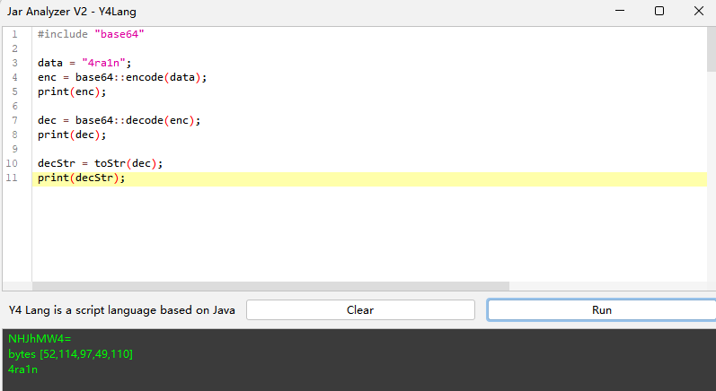

# Jar-Analyzer V2


`Jar Analyzer` is a `GUI` tool for analyzing `Jar` files:
- Supports large `Jar` and batch `Jars` analysis
- Convenient search for relationships between method calls
- Analyzes `LDC` instructions to locate strings in `Jar`
- One-click analysis for `Spring Controller/Mapping`
- Advanced analysis for method bytecode and instructions
- One-click decompile, optimized for inner classes
- One-click generation of method's `CFG` analysis results
- One-click generation of method's `Stack Frame` analysis results
- Remote analyze `Servlet` of `Apache Tomcat`
- Custom `SQL` statement for advanced analysis

More features are under development

Issues and suggestions are welcome

[Go to Download](https://github.com/jar-analyzer/jar-analyzer/releases/latest)

**Uses of `Jar Analyzer`**
- **Scenario 1:** You have a bunch of `JAR` files and need to know in which `JAR` a particular method is defined.
- **Scenario 2:** You have a bunch of `JAR` files and need to know where the `Runtime.exec` method is called.
- **Scenario 3:** You have a bunch of `JAR` files and need to know in which methods the string `${jndi}` exactly appears.
- **Scenario 4:** You have a bunch of `JAR` files and need to know all the `Spring Controllers` and routes.
- **Scenario 5:** You need to deeply analyze the passing parameters of `JVM` instructions within a method.
- **Scenario 6:** You need to deeply analyze the state of `JVM` instructions and stack frames within a method.
- **Scenario 7:** You need to deeply analyze the `Control Flow Graph` of a method.
- **Scenario 8:** You need to analyzer `Servlet/Filter/Listener` from a Tomcat

Note:
- Do not double-click to start on `Windows`, please use `java -jar` or double-click the `bat` script
- If using `java -jar` causes garbled text, add `-Dfile.encoding=UTF-8` parameter

## Some Screenshots

Instruction Analysis


`CFG` Analysis


Graphical `Stack Frame` Analysis


Analyzing `Spring Framework`


Support Tomcat Analyzer since 2.8


Custom `SQL` Query Analysis


A script language based on `Java`



Method Call Search (supports `equals/like` options, blacklist filtering)


Method Call Relationships


## Notes

This tool has been adapted for `1080P` (considering most machines should be at or above this resolution)

If your computer does not display correctly at `1080P`, adjust the scaling to `100%`

For example, in `Windows 11`: Right-click to display settings


The basic principle of this tool:
- Unzip all `Jar` files to `jar-analyzer-temp` directory
- Build a database `jar-analyzer.db` file in the current directory
- Create a `.jar-analyzer` file in the current directory to record the status


Note: A large number of `Jar` files or huge sizes might cause the temporary directory and database file to become very large

If you do not want to run `GUI`, here is a cli version

```text
Usage: java -jar jar-analyzer.jar [command] [command options]
  Commands:
    build      build database
      Usage: build [options]
        Options:
          --del-cache
            delete old cache
            Default: false
          --del-exist
            delete old database
            Default: false
          -j, --jar
            jar file/dir

    gui      start jar-analyzer gui
      Usage: gui
```

Example: build `test.jar` database and delete cache and old database

```shell
java -jar jar-analyzer.jar build --jar 1.jar --del-cache --del-exist
```

## Release Notes

Four types of downloads available in `release`:
- `system`: Startup script using system `JDK/JRE` (requires `JRE` installation)
- `embed`: Startup script with embedded `JRE` (no additional installation required)
- `linux`: Startup script with embedded `shell` (requires `JRE` installation)
- Simple `Jar` file, without a startup script

As this tool has been tested only on `Windows`, there might be unknown issues on other operating systems. Issues are welcome

Generally, it's recommended to use the `embed` version with embedded `JRE` for startup

## Subprojects

### Tomcat Analyzer

[doc](TOMCAT.MD)

### Y4-HTTP

Located in `me.n1ar4.http`, this is a manual construction and parsing `HTTP/1.1` protocol `HTTP` client library

[Code](../src/main/java/me/n1ar4/http)

### Y4-JSON

Located in `me.n1ar4.y4json`, this is a simple `JSON` serialization and deserialization library mimicking `Fastjson API`

[Code](../src/main/java/me/n1ar4/y4json)

### Y4-LOG

Located in `me.n1ar4.log`, this is a logging library mimicking `Log4j2 API`

[Code](../src/main/java/me/n1ar4/log)

## How to Build

Building is generally based on `Java 8`
- Download `JDK 8`
- Use `Maven` (https://maven.apache.org/download.cgi)
- Use `Python 3` for assistance (https://www.python.org/downloads/)

Steps:

1. mvn -B package -DskipTests --file pom.xml
2. python build.py
3. Copy JRE to embed version

## Other

`Jar Analyzer` subprojects:
- [Y4 JSON](https://github.com/jar-analyzer/y4-json) provides `JSON` serialization and deserialization for `Jar Analyzer`

If you want to experience the old version (no longer maintained) of `Jar Analyzer`, you can visit:
- https://github.com/4ra1n/jar-analyzer-cli
- https://github.com/4ra1n/jar-analyzer-gui

Why choose `Jar Analyzer V2` over `IDEA`:
- `IDEA` does not support analysis of `Jar` files without source code
- This tool has some advanced features that `IDEA` does not support (Instruction/CFG/Stack analysis)

## Acknowledgements

Thanks to the following projects for ideas and code:
- https://github.com/JetBrains/intellij-community/tree/master/plugins/java-decompiler/engine
- https://github.com/bobbylight/RSyntaxTextArea
- https://github.com/JackOfMostTrades/gadgetinspector
- https://github.com/lsieun/learn-java-asm