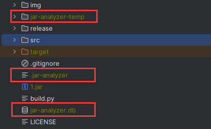

## 注意事项

### 体积问题

注意：请勿分析数量极多或体积巨大的 `JAR` 文件，可能导致巨大的临时文件和数据库，以及高内存消耗

### 显示问题

如果 `Mac` 无法显示完全，请在显示器设置中勾选 `更多空间`

### 乱码问题

注意：
- 在 `Windows` 下请勿双击启动，请使用 `java -jar` 或双击 `bat` 脚本启动
- 如果使用 `java -jar` 启动乱码，请加入 `-Dfile.encoding=UTF-8` 参数

### 显示问题

本工具已经根据 `1080P` 适配 （考虑到绝大多数机器应该大于等于这个分辨率）

如果你的电脑在 `1080P` 下无法正常显示，请调整缩放到 `100%`

以 `Windows 11` 为例：右键显示设置

### 原理相关

本工具的基本原理：
- 解压所有 `Jar` 文件到 `jar-analyzer-temp` 目录
- 在当前目录构建数据库 `jar-analyzer.db` 文件
- 在当前目录新建文件 `.jar-analyzer` 记录状态

注意：当 `Jar` 数量较多或巨大时**可能导致临时目录和数据库文件巨大**