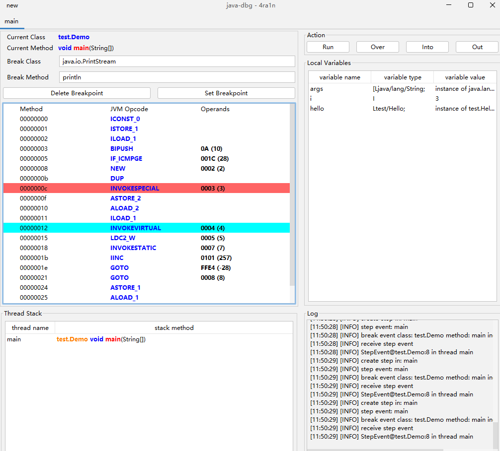

## 其他

### 进阶功能

以上是基础功能，进阶和测试性的功能请参考：[进阶测试性功能](../doc/README-advance.md)

例如类似 `OD/GDB` 的指令级 `GUI` 调试（未完成）



### 快捷键

- `CTRL+X` 方法交叉引用 快速跳转方法 `caller` 和 `callee` 页面
- `CTRL+F` 代码区域搜索 打开搜索面板 支持 `next` 和 `prev` 选项
- `CTRL+F` 文件树区搜索 显示搜索面板 搜索文件树中的类名以及内部类

### UI 主题

支持以下：

- default (默认使用 类似 `IDEA` 主题)
- metal
- win (仅 `Windows` 支持)
- win-classic (仅 `Windows` 支持)
- motif
- mac (仅 `MacOS` 支持)
- gtk (仅某些 `Linux` 支持)
- cross
- aqua (仅 `MacOS` 支持)
- nimbus

在启动时指定：`java -jar jar-analyzer.jar gui -t [theme]`

例如：`java -jar jar-analyzer.jar gui -t win-classic`

或者修改启动脚本的代码

```shell
set "theme_name=default"
```

早期的一些文章和视频

### 文章视频

用户使用文章

- [利用 jar-analyzer 分析 CVE-2022-42889](https://www.bilibili.com/video/BV1a94y1E7Nn)
- [某人力系统的代码审计](https://forum.butian.net/share/3109)

用户使用视频

- [Jar Analyzer V2 教程（早期版本）](https://www.bilibili.com/video/BV1ac411S7q4)
- [通过 jar-analyzer 分析漏洞 CVE-2022-42889](https://www.bilibili.com/video/BV1a94y1E7Nn)
- [Jar Analyzer V2 新版本功能介绍](https://www.bilibili.com/video/BV1Dm421G75i)

如果你希望体验老版本 (不再维护) 的 `Jar Analyzer` 可以访问：
- https://github.com/4ra1n/jar-analyzer-cli
- https://github.com/4ra1n/jar-analyzer-gui

### 说明

为什么我不选择 `IDEA` 而要选择 `Jar Analyzer V2` 工具：
- 因为 `IDEA` 不支持分析无源码的 `Jar` 包
- 本工具有一些进阶功能是 `IDEA` 不支持的 (指令/CFG/Stack分析)

(1) 什么是方法之间的关系

```java
class Test{
    void a(){
        new Test().b();
    }
    
    void b(){
        Test.c();
    }
    
    static void c(){
        // code
    }
}
```

如果当前方法是 `b`

对于 `a` 来说，它的 `callee` 是 `b`

对于 `b` 来说，它的 `caller` 是 `a`

(2) 如何解决接口实现的问题

```java
class Demo{
    void demo(){
        new Test().test();
    }
}

interface Test {
    void test();
}

class Test1Impl implements Test {
    @Override
    public void test() {
        // code
    }
}

class Test2Impl implements Test {
    @Override
    public void test() {
        // code
    }
}
```

现在我们有 `Demo.demo -> Test.test` 数据, 但实际上它是 `Demo.demo -> TestImpl.test`.

因此我们添加了新的规则： `Test.test -> Test1Impl.test` 和 `Test.test -> Test2Impl.test`.

首先确保数据不会丢失，然后我们可以自行手动分析反编译的代码
- `Demo.demo -> Test.test`
- `Test.test -> Test1Impl.test`/`Test.test -> Test2Impl.test`

(3) 如何解决继承关系

```java
class Zoo{
    void run(){
        Animal dog = new Dog();
        dog.eat();
    }
}

class Animal {
    void eat() {
        // code
    }
}

class Dog extends Animal {
    @Override
    void eat() {
        // code
    }
}

class Cat extends Animal {
    @Override
    void eat() {
        // code
    }
}
```
`Zoo.run -> dog.cat` 的字节码是 `INVOKEVIRTUAL Animal.eat ()V`, 但我们只有这条规则 `Zoo.run -> Animal.eat`, 丢失了 `Zoo.run -> Dog.eat` 规则

这种情况下我们添加了新规则： `Animal.eat -> Dog.eat` 和 `Animal.eat -> Cat.eat`

首先确保数据不会丢失，然后我们可以自行手动分析反编译的代码
- `Zoo.run -> Animal.eat`
- `Animal.eat -> Dog.eat`/`Animal.eat -> Cat.eat`

注意：以上的配置在 `3.0` 及以前的版本中是必须且无法取消的

但是在 `3.1` 版本中新增了配置，通过左上角 `config` 可以勾选 `enable/disable`