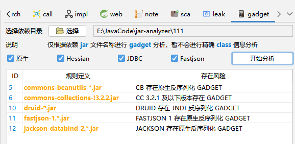
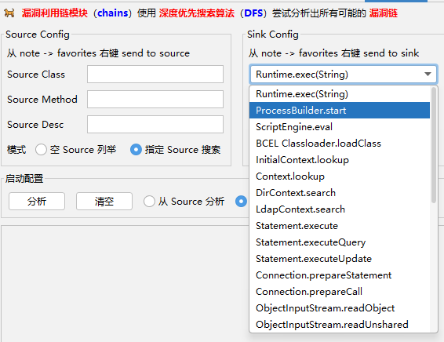

## 截图

方法调用关系

方法调用搜索 (支持 `equals/like` 选项，支持黑名单过滤)

`Jar Analyzer 2.15` 版本以后支持代码区域的搜索

`Jar Analyzer 2.15` 版本以后支持远程 `Jar` 文件加载

`Jar Analyzer 2.17` 版本以后支持从序列化数据中一键提取恶意代码

`Jar Analyzer 2.18` 版本以后支持 `HTTP API`

[示例图 1](../img/0038.png) [示例图 2](../img/0037.png)

`Jar Analyzer 2.19` 版本以后支持实时的 `CPU` 和内存占用分析

`Jar Analyzer 2.20` 版本后支持选中字符串全局高亮显示

`Jar Analyzer 5.1` 版本后支持了简单的 `Gadget` 分析

规则清晰简单，写在文件 `src/main/resources/gadget.dat` 中，欢迎贡献更多

自从 `5.5` 版本后默认了常见的漏洞 `sink` 点用于分析漏洞链

