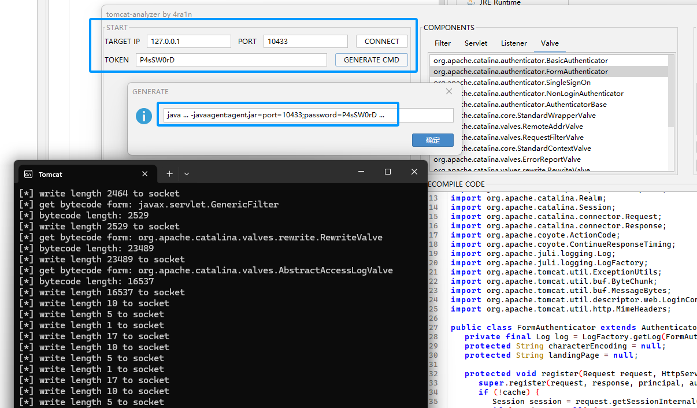

## 子项目

### Tomcat Analyzer

该项目位于 `me.n1ar4.shell.analyzer` 中，这是一个分析 `Tomcat` 的工具

[代码](../src/main/java/me/n1ar4/shell/analyzer)

该项目原名 `shell-analyzer` 现改名 `tomcat-analyzer`



只需要你在 `tomcat` 启动时指定监听端口和密码即可远程分析

修改 `catalina.bat/sh` 启动文件


```shell
-javaagent:agent.jar=port=[port];password=[password]
```

### Y4-LOG

该项目位于`me.n1ar4.log`中，这是一个模仿`Log4j2 API`的日志库

[代码](../src/main/java/me/n1ar4/log)