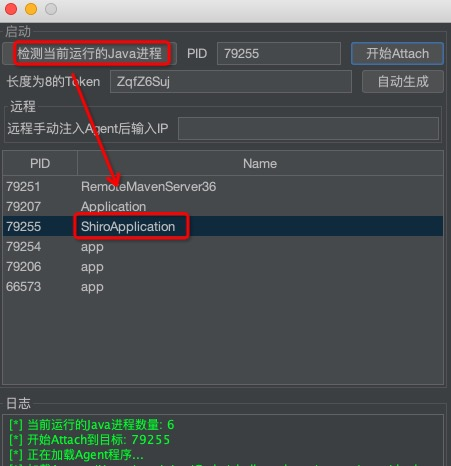
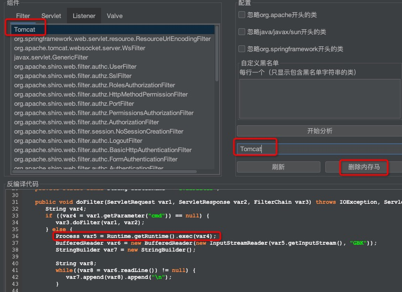
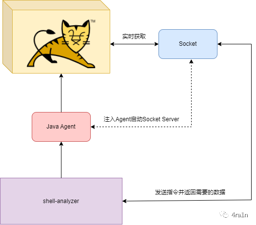
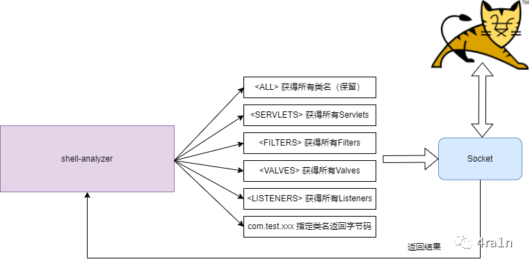

## 子项目

### Tomcat Analyzer

该项目位于`me.n1ar4.shell.analyzer`中，这是一个分析`Tomcat`内存马的工具

[代码](../src/main/java/me/n1ar4/shell/analyzer)

该项目原名`shell-analyzer`现改名`tomcat-analyzer`

(1) 第一步：检测进程并`Attach`

为了防止目标被恶意利用，需要输入一个密码

**注意：尽管使用了密码保护，但还是存在拒绝服务等风险，请勿在生产环境使用，目前适用于自己搭建靶机分析学习**

(2) 第二步：勾选并分析

点击**刷新**即可获得实时的数据

(3) 双击任意一个类即可`Dump`并反编译

(4) 复制类名过去即可修复内存马

将`Agent`动态`Attach`到目标后会开启一个端口(10032)监听：
- 该端口会反序列化收到的数据，然后处理，我已经给反序列化设置了白名单进行保护
- 启动`Agent`时会设置密码，如果客户端连接密码不匹配将无法获得数据
- 为什么选择 10032 端口，因为这个数字代表一个

该端口用于实时接受指令并处理后返回数据，图中是部分指令（不完全）

支持一键查杀的内存马类型

| 类型       | 类名                                   | 方法名                | 
|:---------|:-------------------------------------|:-------------------|
| Filter   | javax.servlet.Filter                 | doFilter           | 
| Filter   | javax.servlet.http.HttpFilter        | doFilter           | 
| Servlet  | javax.servlet.Servlet                | service            | 
| Servlet  | javax.servlet.http.HttpServlet       | doGet              | 
| Servlet  | javax.servlet.http.HttpServlet       | doPost             | 
| Servlet  | javax.servlet.http.HttpServlet       | doHead             | 
| Servlet  | javax.servlet.http.HttpServlet       | doPut              | 
| Servlet  | javax.servlet.http.HttpServlet       | doDelete           | 
| Servlet  | javax.servlet.http.HttpServlet       | doTrace            | 
| Servlet  | javax.servlet.http.HttpServlet       | doOptions          | 
| Listener | javax.servlet.ServletRequestListener | requestDestroyed   | 
| Listener | javax.servlet.ServletRequestListener | requestInitialized | 
| Valve    | org.apache.catalina.Valve            | invoke             |

### Y4-LOG

该项目位于`me.n1ar4.log`中，这是一个模仿`Log4j2 API`的日志库

[代码](../src/main/java/me/n1ar4/log)