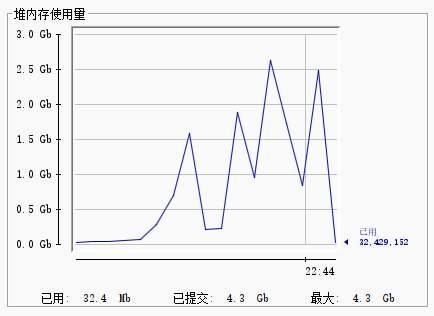
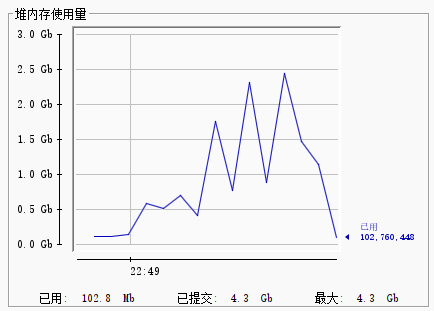
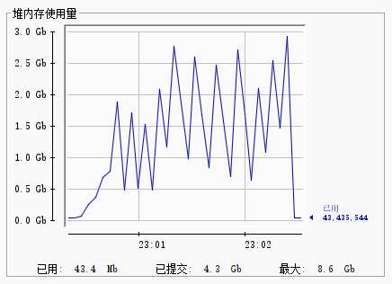
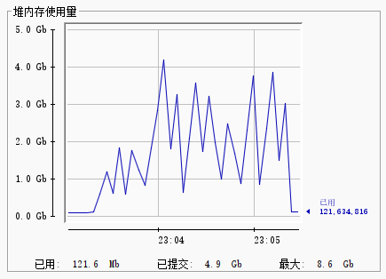

## 性能对比

新版本同时支持了内置 `JAVA 8` 和 `JAVA 21` 的版本

统一参数：`-Xms4g -Xmx8g`

### 分析 20M JAR

`JRE 8` 开启 `G1GC`

`JRE 21` 开启 `ZGC`

### 分析 JRE 8

`JRE 8` 开启 `G1GC` 时间 `76` 秒

`JRE 21` 开启 `ZGC` 时间 `73` 秒

### 结论

对于 `jar-analyzer` 来说，无法得出 `ZGC` 性能强于 `G1GC` 的结论

分析较大 `JAR` 文件时明显看得出 `ZGC` 消耗内存更大