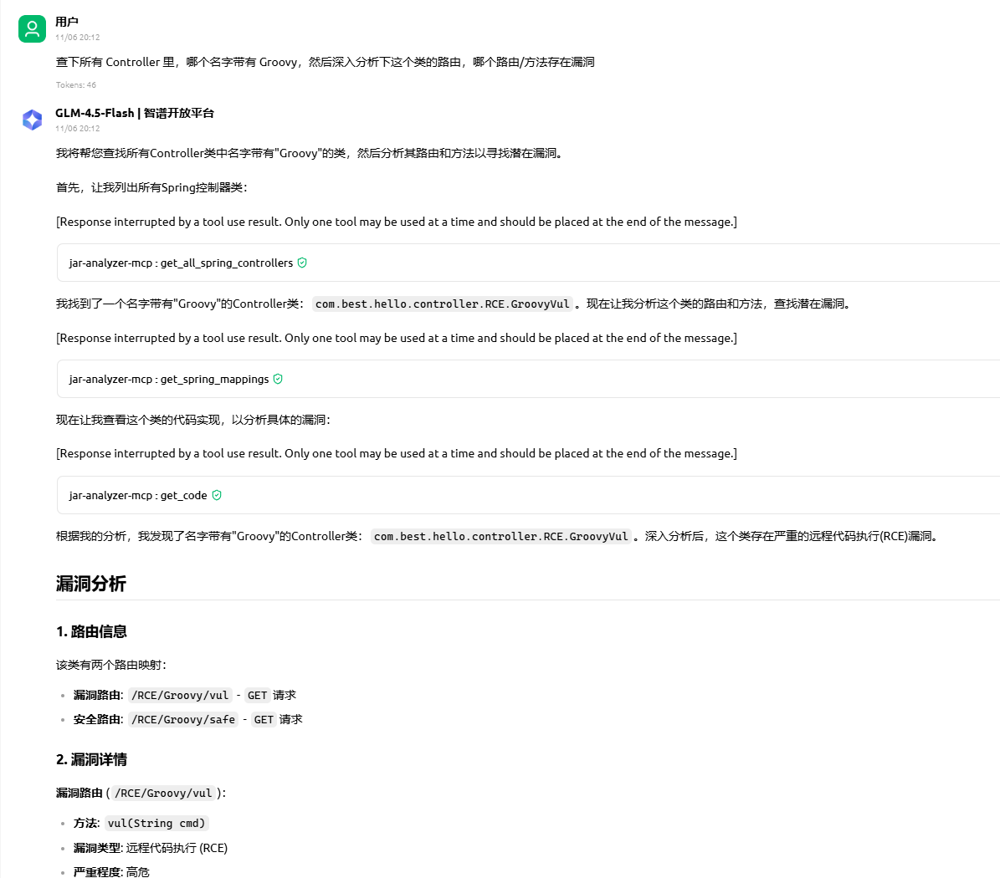
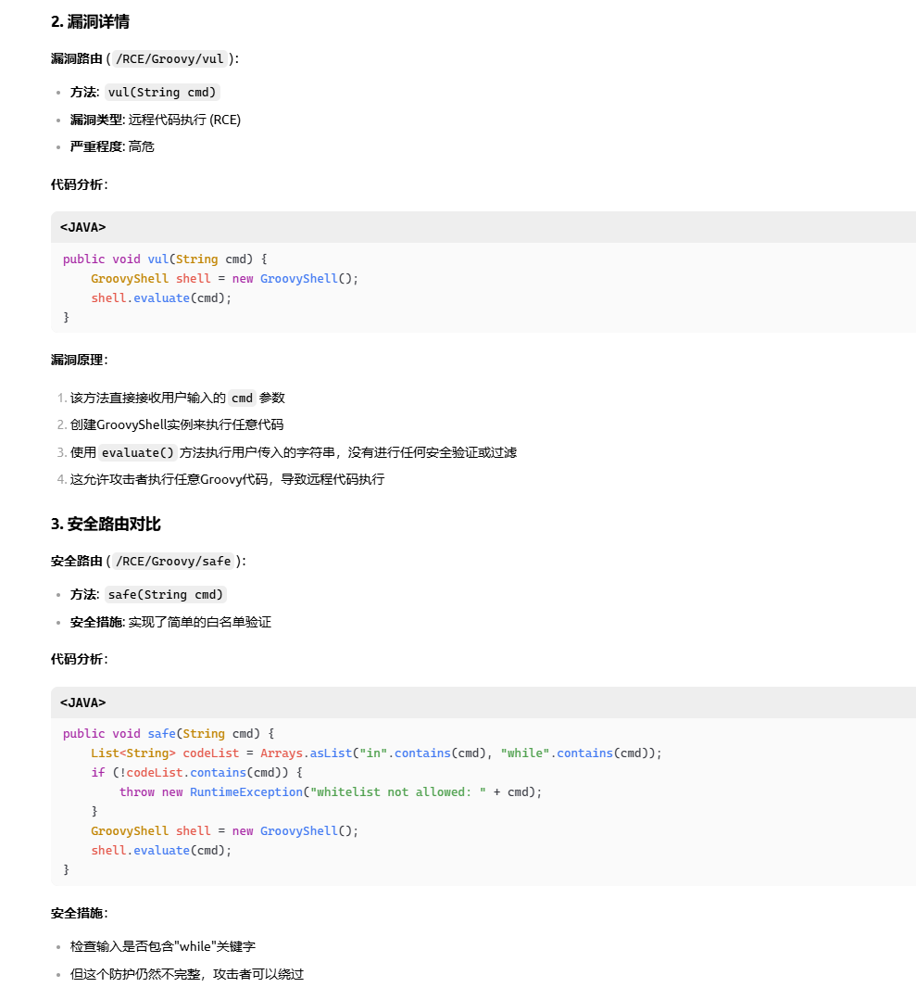
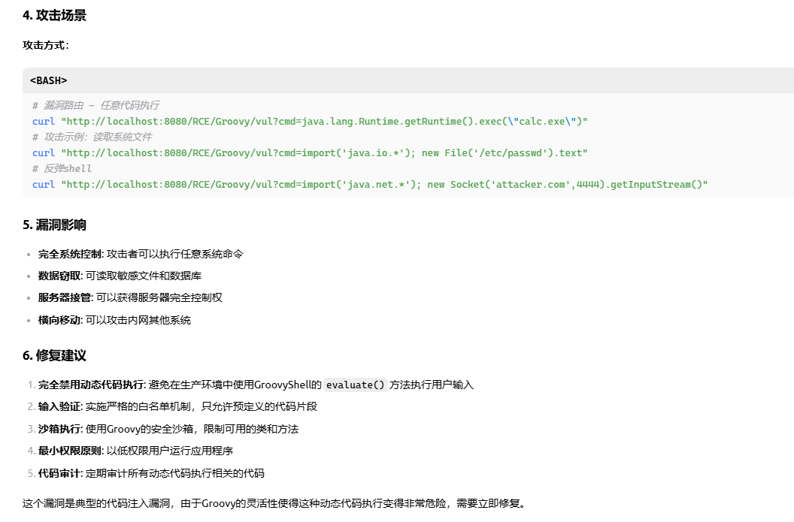
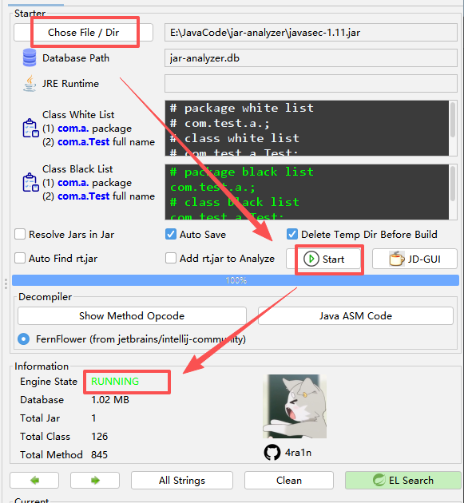
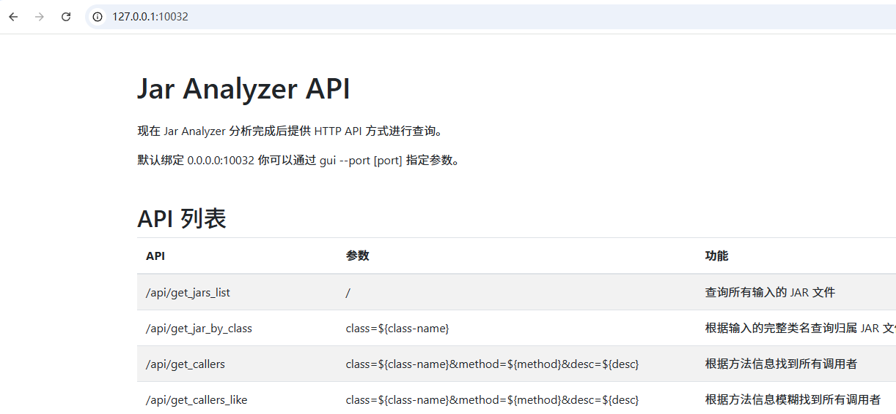
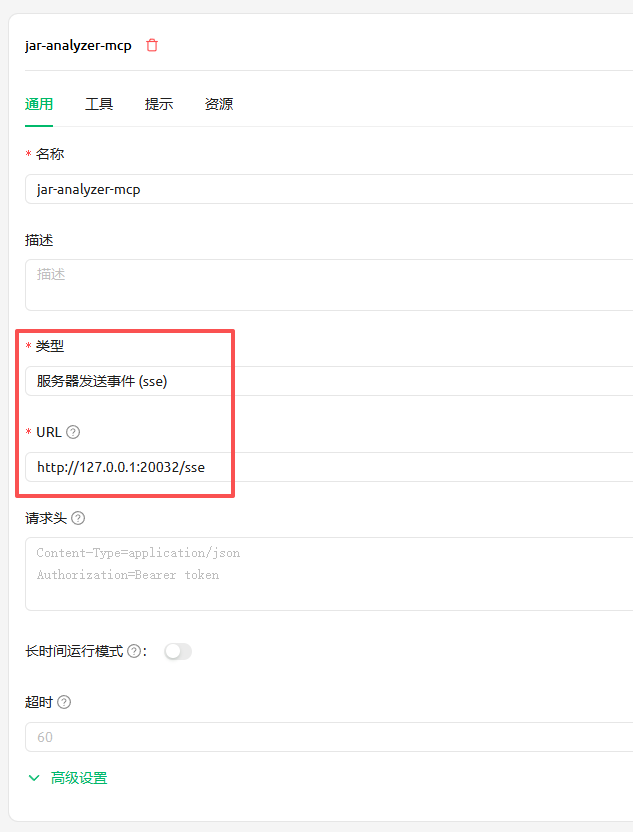
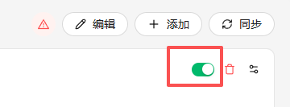
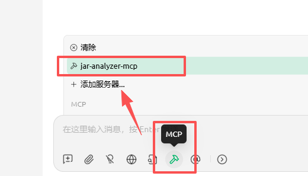

# jar-analyzer-mcp

## 功能展示







## 前置工作

使用 `MCP` 必须确保你的项目已经分析完毕



选择 `Jar` 点击 `Start` 等待完成分析

`jar-analyzer api` 默认开在 `127.0.0.1:10032`



你也可以编辑启动脚本或者启动时使用 `java -jar jar-analyzer.jar gui --port 10033` 指定其他端口

当你确认已完成分析并且 `api` 可用时，即可使用 `jar-analyzer-mcp`

## 启动 MCP

下载好对应版本的 `MCP` 可执行文件（或自行编译）

直接在命令行运行即可，默认端口 `20032`

你也可以自行指定 `MCP 端口` 和 `jar-analyzer api` 地址

```shell
mcp.exe -port 20032 -url http://127.0.0.1:10032
```

如果启动不报错，说明已经完成启动

## 配置 MCP

以 `Cherry Studio` 为例进行配置

请勾选 `服务器发送事件（SSE）` 并且 `URL` 使用 `/sse` 结尾



或者使用 `JSON` 配置

```json
{
  "mcpServers": {
    "jar-analyzer-mcp": {
      "url": "https://127.0.0.1:20032/sse"
    }
  }
}
```

右上角开启 `MCP`



使用 `MCP` 时请开启



接下来就可以正常使用了

