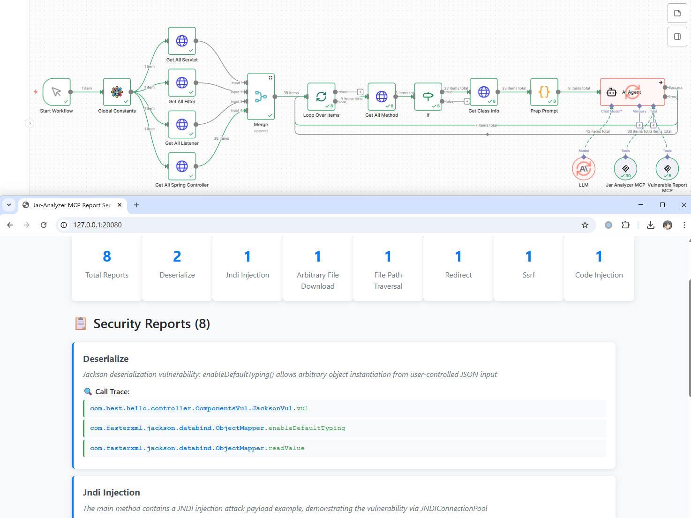
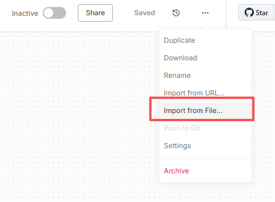
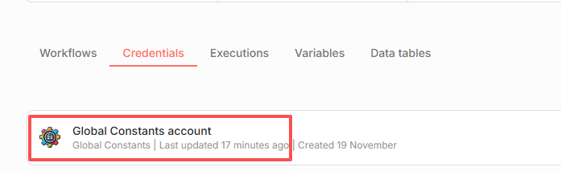
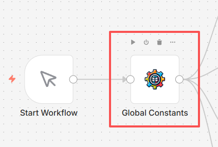
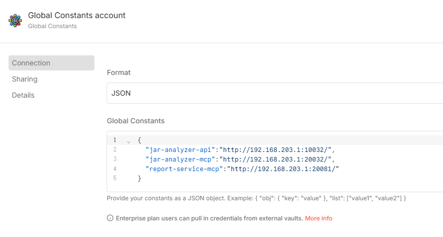
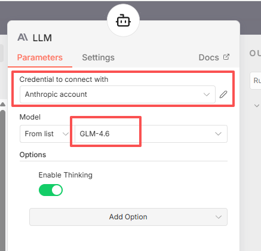
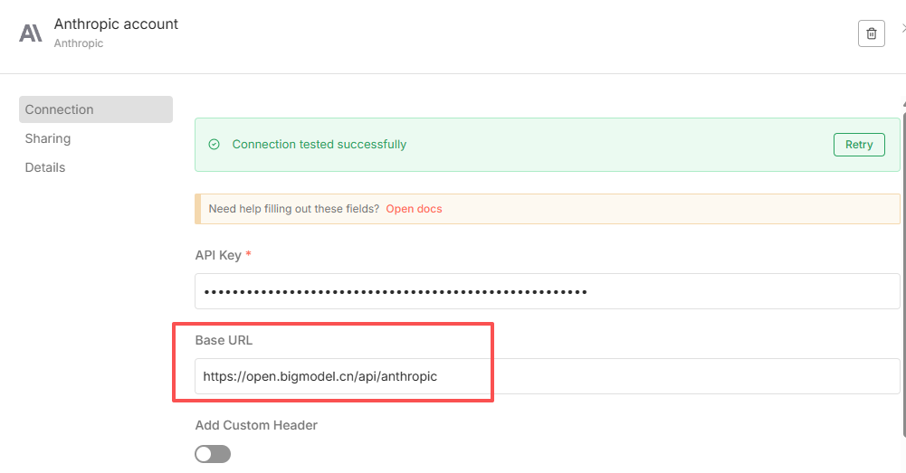
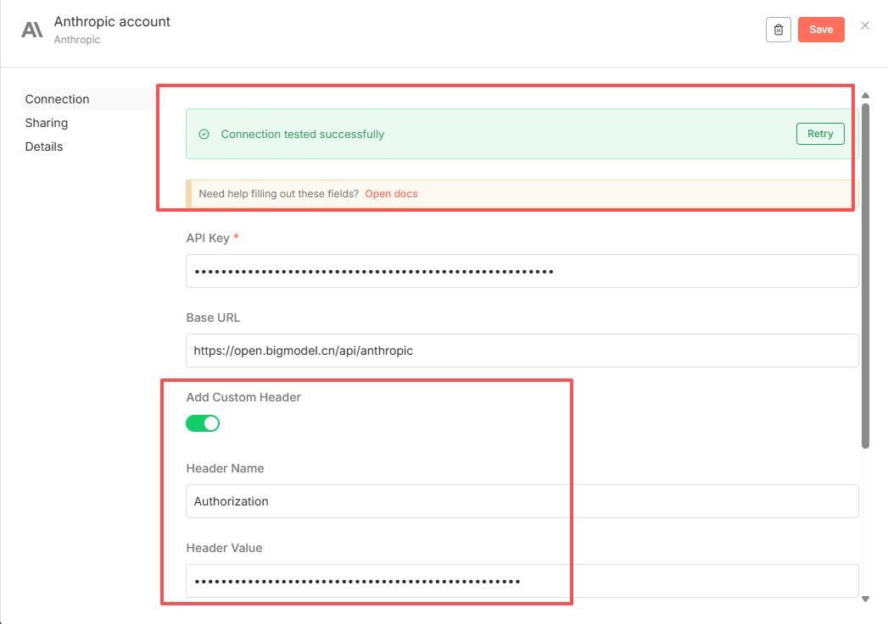
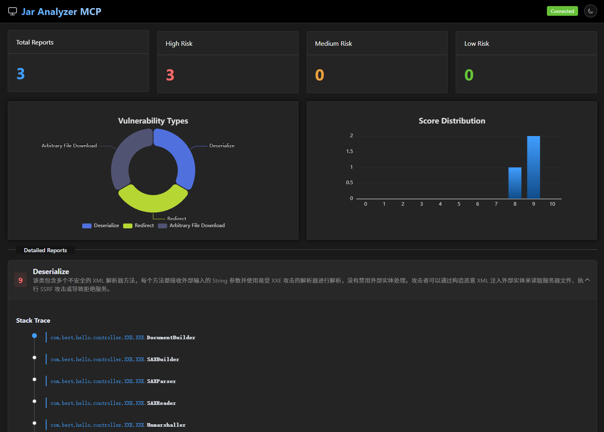

## jar-analyzer-n8n

特别致谢：

- whw1sfb (https://github.com/whwlsfb)
- L-codes (https://github.com/L-codes)
- osword (https://github.com/zhzhdoai)

感谢以上大佬分享 `jar-analyzer mcp` 基于 `n8n` 平台更高级的用法



## 0x01 部署 n8n

什么是 `n8n`

官方介绍翻译：具备原生 `AI` 能力的 `Fair-code` 工作流自动化平台

https://github.com/n8n-io/n8n

```shell
docker pull n8nio/n8n:2.3.0

docker run -it --name n8n -p 5678:5678 \
  -e N8N_HOST="0.0.0.0" \
  -e N8N_PORT=5678 \
  -e N8N_PROTOCOL="http" \
  -e GENERIC_TIMEZONE="Asia/Shanghai" \
  -e N8N_SECURE_COOKIE=false \
  n8nio/n8n:2.3.0
```

请先启动 `mcp` 和 `report-mcp`

默认端口分别为 `20032` 和 `20081` 并监听了 `20080` 为 `web` 端口

## 0x02 导入配置文件

请使用 `n8n-doc` 目录的 [jar-analyzer-workflow.json](jar-analyzer-workflow.json) 文件



选择 `import from file` 导入文件


## 0x03 配置

导入后需要完成几项配置：

安装插件：https://www.npmjs.com/package/n8n-nodes-globals



或者点击 `Global Constants` 会有红点，点击后安装



点开该插件，配置三大关键常量，注意必须以 `/` 结尾



注意 `Format` 选择 `JSON` 具体内容参考

```json
{
  "jar-analyzer-api":"http://192.168.203.1:10032/",
  "jar-analyzer-mcp":"http://192.168.203.1:20032/",
  "report-service-mcp":"http://192.168.203.1:20081/"
}
```

点开 `LLM` 进行配置





其中 `API` 可以使用 `bigmodel.cn` 的 `anthropic` 格式

`https://open.bigmodel.cn/api/anthropic`

注意如果连接报错，可以额外配置一个 `Header` 再尝试



接下来就可以启动了

成果展示（访问 `report-mcp` 的 `web` 端口 `20080`）

