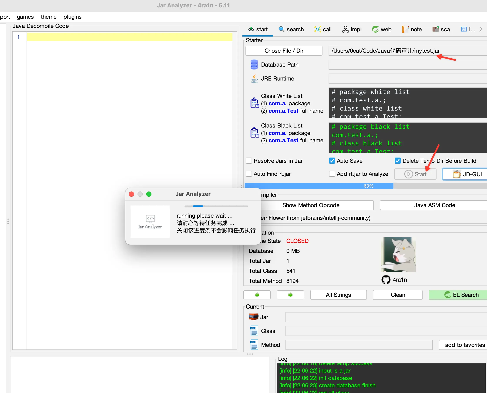
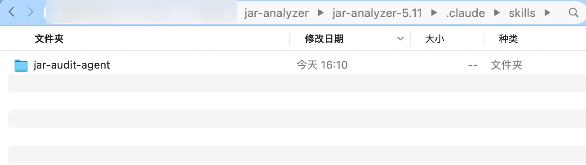
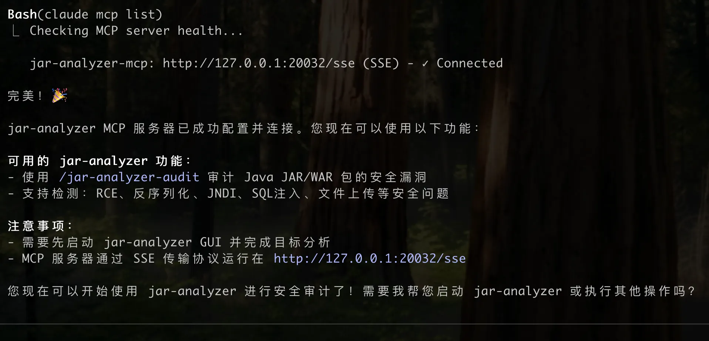
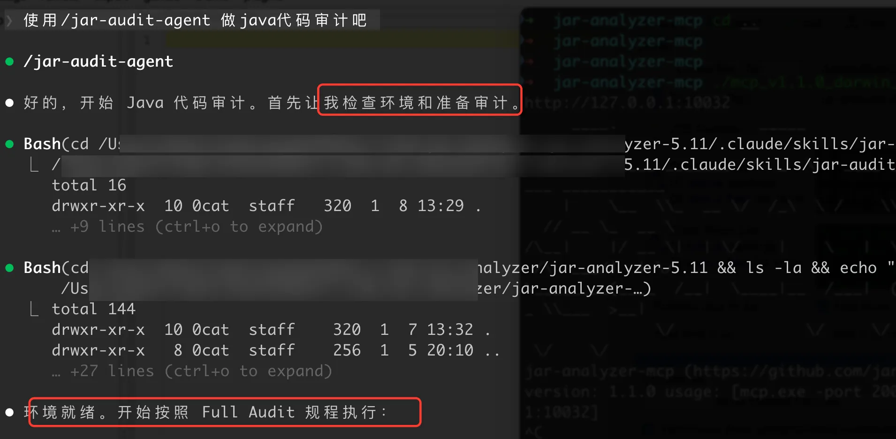
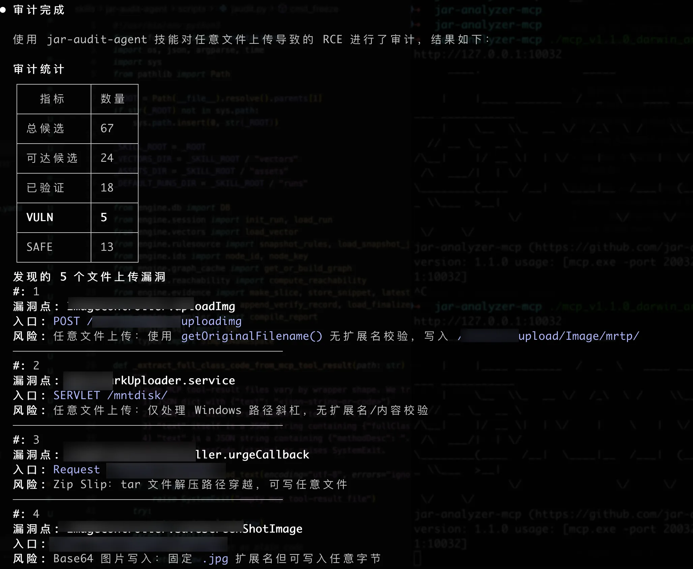
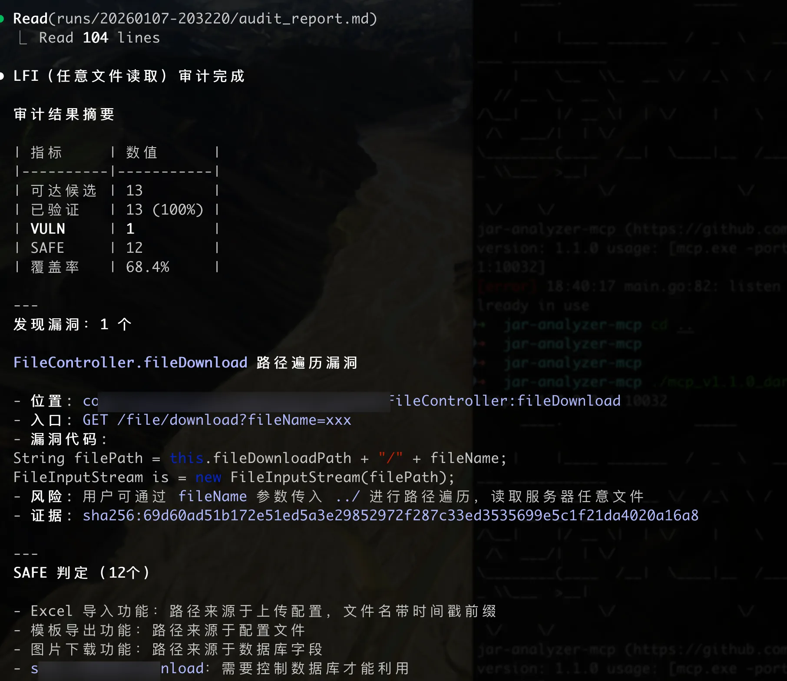

# Claude Skills jar-audit-agent 的 README

作者：（0cat）https://github.com/0cat-r

> 使用 `jar-audit-agent` skill 配合 Jar-analyzer 进行 Java 代码审计

---

## 一、jar-audit-agent 架构概览

```
jar-audit-agent/
├── SKILL.md                 # [核心] 技能定义文件 (Prompt + SOP)
├── assets/                  # [资源] 报告模板与辅助文件
│   ├── report_template.md.j2    # Jinja2 报告模板
│   └── ...                      # severity_rubric.yaml, badges 等
├── engine/                  # [内核] Python 分析引擎 (无状态工具集)
│   ├── db.py                    # SQLite 交互层
│   ├── graph_cache.py           # 调用图构建与缓存
│   ├── reachability.py          # BFS 可达性算法与链路回溯
│   ├── verify.py                # 证据校验 (Fail-Closed 核心逻辑)
│   ├── evidence.py              # 代码切片与 MCP 取证封装
│   └── ...                      # compiler, slicer, sql, vectors 等
├── references/              # [知识库] 供 Agent 查阅的静态文档
│   ├── DATABASE_SCHEMA.md       # 数据库表结构说明 (事实基线)
│   └── TACTICS_LIBRARY.md       # 审计战术手册 (操作 SOP 与禁令)
├── schemas/                 # [契约] JSON 数据交换标准
│   ├── batch.json               # 批次任务定义
│   ├── verify.jsonl.schema.json # 验证结果格式约束
│   └── ...                      # candidate, freeze, inventory 等
├── scripts/                 # [入口] 命令行工具
│   ├── cli.py                   # 统一 CLI 入口
│   └── jaudit.py                # 主程序逻辑
└── vectors/                 # [策略] 分层审计规则 (按需加载)
    ├── rce.yaml                 # RCE 规则配置
    ├── sqli.yaml                # SQL 注入规则
    ├── auth.yaml                # 越权检测规则
    ├── spring_mvc.yaml          # 入口定义
    └── ...                      # jndi, lfi, ssti, xxe 等 16+ 个向量
```


### vectors 目录说明

`vectors` 目录下的 YAML 既是**筛选器**，也是**补充规则**。在 Freeze 阶段，程序执行"提取 + 合并"逻辑：

1. **提取原生规则**：根据 `rule_sources` 定义的 Key，从 Jar-analyzer 自带的 `vulnerability.yaml` 和 `dfs-sink.json` 中提取对应的 Sink
2. **合并补充规则**：将 `vectors` 文件中 `sinks` 字段定义的额外规则与上述结果合并

### 设计自由度

| 维度 | 自由度 | 核心逻辑 |
|:---|:---|:---|
| **操作环境** | 🔴 低 | 严格限制：防幻觉、保证运行稳定 |
| **输出格式** | 🔴 低 | 强契约 |
| **流程决策** | 🟡 中 | 框架引导：适应不同项目架构 |
| **代码思考** | 🟢 高 | 语义开放：充分利用 LLM 对 Java 语义和安全漏洞的理解 |

---

## 二、审计流程

### Phase 1: 环境初始化与基线构建

| 步骤 | 命令 | 说明 |
|:---|:---|:---|
| **INIT** | `python3 scripts/cli.py init` | 建立 `runs/<id>/` 目录结构，初始化 SQLite 链接 |
| **PROFILE** | `python3 scripts/cli.py profile ...` | 读取规则文件，统计 Controller/Servlet/Filter 数量，生成技术栈 |
| **GRAPH** | `python3 scripts/cli.py graph ...` | 从 DB 读取 `method_call_table`，在内存中构建有向图 |

### Phase 2: 静态筛选与降噪

| 步骤 | 命令 | 说明 |
|:---|:---|:---|
| **FREEZE** | `python3 scripts/cli.py freeze --vector <v>` | 加载规则，执行 SQL 查询检索 Sink 调用点 |
| **REACH** | `python3 scripts/cli.py reach --vector <v>` | BFS 算法计算 Entry → Sink 最短路径，标记不可达节点 |

### Phase 3: AI 研判循环

按 Batch 循环执行，直到队列处理完毕：

| 步骤 | 命令 | 说明 |
|:---|:---|:---|
| **NEXT** | `python3 scripts/cli.py next ...` | 从队列提取高优先级候选者，生成 `batch.json` |
| **EVIDENCE** | `... evidence --candidate-id <id>` | 通过 MCP 调用 `get_code_fernflower` 接口，进行代码切片 |
| **SUBMIT** | `... submit --status VULN/SAFE` | AI 分析代码，执行 Fail-Closed 校验后提交结论 |

### Phase 4: 归档与交付

| 步骤 | 命令 | 说明 |
|:---|:---|:---|
| **REPORT** | `python3 scripts/cli.py report ...` | 汇总结果，计算覆盖率，渲染 Markdown 报告 |

---

## 三、快速使用

> 💡 本文使用 MiniMAX 2.1 作为 LLM 后端（性价比较高）
>
> claude接入文档：
> - [智谱 GLM 接入文档](https://docs.bigmodel.cn/cn/coding-plan/tool/claude#claude-code)
> - [MiniMax 接入文档](https://platform.minimaxi.com/docs/coding-plan/claude-code)

### 3.1 准备工作

#### Step 1: 分析目标 JAR/WAR

将需要审计的 jar/war 放到 Jar-analyzer 中，点击 **Start** 完成分析。



#### Step 2: 安装 Skill

假设 Jar-analyzer 目录为 `/Users/xxx/jar-analyzer/jar-analyzer-5.11`

```bash
# 创建 skills 目录
mkdir -p /Users/xxx/jar-analyzer/jar-analyzer-5.11/.claude/skills/

# 将 jar-audit-agent 文件夹放入该目录
```



#### Step 3: 安装 Python 依赖

```bash
cd /Users/xxx/jar-analyzer/jar-analyzer-5.11/.claude/skills/jar-audit-agent/scripts
pip3 install -r requirements.txt
```

#### Step 4: 启动 MCP 服务

```bash
./mcp_v1.1.0_darwin_arm64 -port 20032 -url http://127.0.0.1:10032
```

#### Step 5: 添加 MCP 到 Claude Code

```bash
claude mcp add --transport sse jar-analyzer-mcp http://127.0.0.1:20032/sse
```



> ⚠️ 首次配置完成后，建议重启 Claude Code（最新版已支持热加载 skill）

### 3.2 触发使用

回到 Jar-analyzer 目录，启动 Claude：

```bash
cd /Users/xxx/jar-analyzer/jar-analyzer-5.11
claude
```

**触发方式**：在对话中包含 `/jar-audit-agent`（前面带空格）

验证技能加载：询问 "你有哪些 skills"

> 📁 Skill 存放位置：
> - 项目级：`.claude/skills/`
> - 全局级：`~/.claude/skills/`
> - 官方库：https://github.com/anthropics/skills

---

## 四、使用示例

### 4.1 通用审计

```
🙎‍♂️：使用 /jar-audit-agent 做java代码审计吧
```
推荐针对特定漏洞类型进行审计，效果好一些, 不建议直接审计全量。



### 4.2 审计任意文件上传

```
🙎‍♂️：使用 /jar-audit-agent 技能审计任意文件上传脚本文件rce
```



**推荐**：推荐针对特定漏洞类型进行审计。

### 4.3 审计 LFI（任意文件读取）

```
🙎‍♂️：使用 /jar-audit-agent 技能审计下任意文件读取吧
```



---

## 五、局限性

### 已知限制

| 类型 | 说明 |
|:---|:---|
| **配置依赖型漏洞** | Thymeleaf SSTI/RCE 等依赖 `application*.yml`、`templates/*.html` 的漏洞会漏检（DB 不存储这些内容） |
| **规则不完备** | sink/entry 签名解析可能存在缺口 |
| **静态分析盲区** | 动态分发、反射调用等场景难以覆盖 |

### 其他tips

- 师傅们可以引入 Subagent 处理复杂场景
- 师傅们可以尝试 `ralph-wiggum` 和 `planning-with-files` 库做 workflow 编排

### 写在最后

- 希望大家多多给jar-analyzer添加更多AI的能力！
